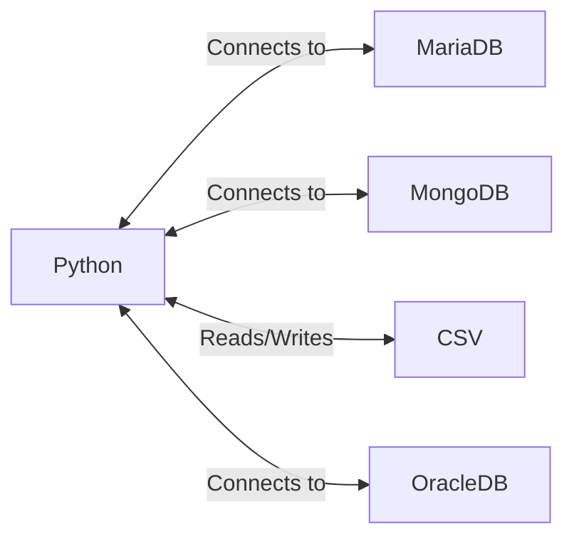
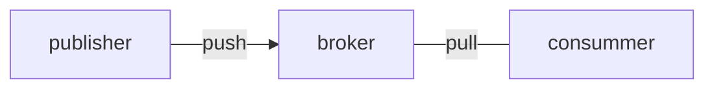
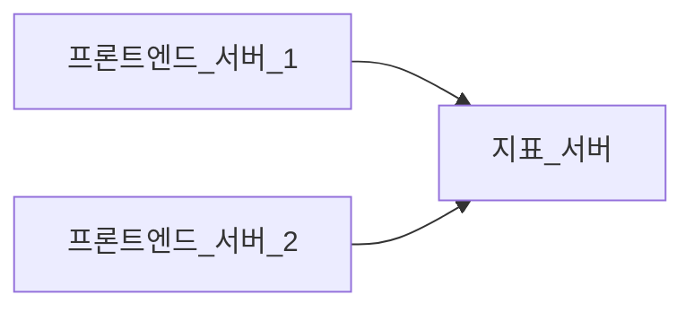

# 발행/구독 시스템 개념이 나온 이유

## 대학 시절에서는

제가 대학 시절과 취준생 시절에 만들었던 프로그램들을 생각을 해보았습니다.

하나의 파이선 프로그램에서 많은 데이터를 끌어 올 수 있도록 설계를 했을 겁니다.

MariaDB, MongoDB, CSV 파일, 그리고 또다른 DB인 ORACLE 까지도 하나의 파이선 프로그램이 다양하게 호출했습니다.

아직까지는 꽤 괜찮아 보입니다.
하나씩 사용한다고 가정한다면 파이선 모듈로 만들거나, 함수로 만들면 다루기 어려워 보이는 숫자는 아닙니다.

### 그렇지만, 현실은?

회사에 입사한 지 얼마 안된 저에게는 처음 접하는 DB인 Redis, ClickHouse, ElasticSearch까지 종류가 많이 늘어났습니다.

종류 뿐만 아니라, 각각의 솔루션들은 서로 실시간으로 통신을 하고 있습니다.
 
아 맞다. DB를 하나만 쓰는 경우는 보지 못했습니다. 
>이중화, 삼중화를 하게 되면 기본적으로 연결되는 수는 많아지게 됩니다.

### 많아 지게 되면 발생하는 문제점은?

우리가 데이터를 적재, 이동시키는 과정 중에서 문제가 발생을 할 때, 연결을 추적해야 하는 과정을 거쳐야 합니다.

직접 연결되는 것들이 많아지게 되면 연결 과정을 찾기가 어렵습니다.

뭐 마치... 내가 어지럽혀진 물건들 중 하나를 찾는 것보다

>"엄마!!" 하면서 외치면서 물건을 찾는 것을 엄마한테 위임(?)하는 것이 빠른 것처럼요.

### 아 이래서 발행/구독 메시지 전달 개념이 나왔구나.
예. 맞습니다.
그래서 발행/구독 메시지 전달 개념이 나왔습니다.

발행/구독 시스템에는 전송자(publisher)는 어떤 형태로든 메시지를 분류해서 보내고
수신자(consummer)는 **분류**된 메시지를 구독합니다.

그리고 그 과정에서 중계해주는 '브로커'가 있습니다.

#### 분류?
'분류'라는 표현을 사용했습니다. 뒤에서 자세히 설명을 하겠지만, 
'분류'는 관계형 데이터베이스에서의 '테이블'로 비유해서 이해하면 좋습니다.

우리는 테이블에 같은 주제(토픽)에 맞는 데이터를 입력합니다. 이렇게 분류가 되어 있기에 수신자 입장에서는 내 입맛에 맞는 데이터만 당길(pull)수 있습니다.

그래서, 꼭 **'분류'** 한다는 표현을 사용합니다.

# 1.1.1 초기의 발행/구독 시스템
초기의 발행/구독 시스템은 브로커를 거치지 않았습니다.

말그대로, '발행하는 자' 와 '구독하는 자' 와의 관계만 있었습니다.

서로가 서로에게 직접 연결하는 방식이였습니다.

두 개의 프론트 엔드 서버에서 발생된 지표들을 한 개의 지표 서버로 보내는 구성입니다.

서비스 초기에는 나쁘지 않는 구성입니다.

그러나, 시간이 지나면서 당연하게도 서버가 늘어나게 됩니다.

단순히, 