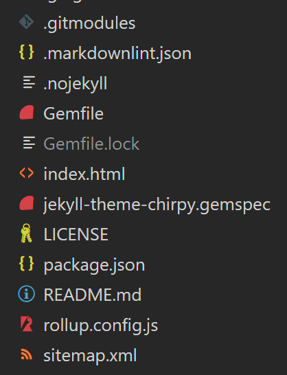
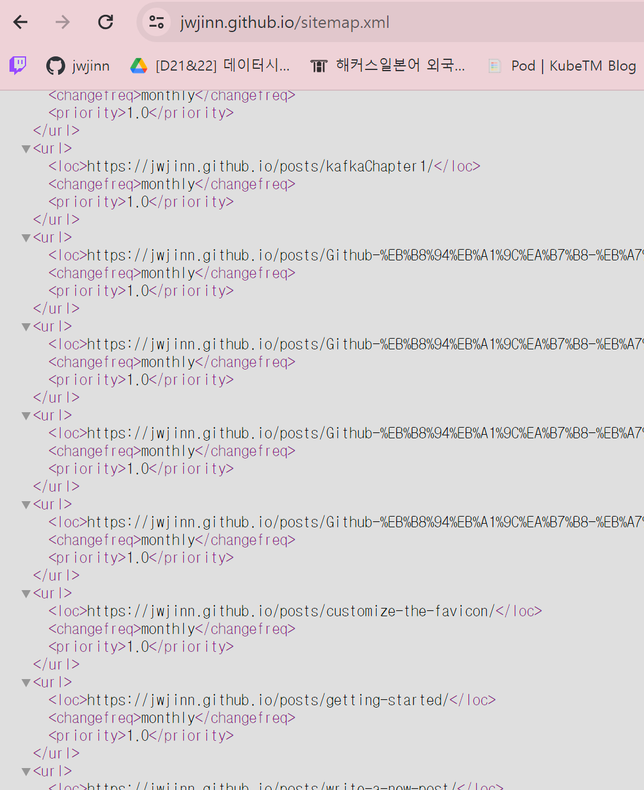
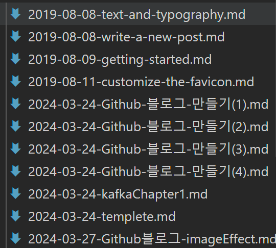

# 공식 사이트 링크
https://jekyllcodex.org/without-plugin/sitemap/

## Installation

1. Download the file sitemap.xml
    - sitemap.xml 파일 생성 후, 내용을 붙여넣었습니다.
2. Save the file in the root of your Jekyll project
3. Make sure the structure of your documents head looks like this:

## sitemap.xml 파일 생성 후 붙여넣기
>  ✓ 루트 경로 확인



### xml 내용

```xml

---
layout: null
---
<?xml version="1.0" encoding="UTF-8"?>
<urlset xmlns:xsi="http://www.w3.org/2001/XMLSchema-instance" xsi:schemaLocation="http://www.sitemaps.org/schemas/sitemap/0.9 http://www.sitemaps.org/schemas/sitemap/0.9/sitemap.xsd" xmlns="http://www.sitemaps.org/schemas/sitemap/0.9">
  
  
      <url>
        <loc>{{ site.url }}{{ page.url }}</loc>
        <changefreq>monthly</changefreq>
        <priority>1.0</priority>
       </url>
  
  
  
      <url>
        <loc>{{ site.url }}{{ page.url | replace: 'index.html', '' }}</loc>
        <changefreq>monthly</changefreq>
        <priority>1.0</priority>
       </url>
  
</urlset>

```

## head에 적용
경로: `_includes/head.html`

```javascript
<head>
  <meta http-equiv="Content-Type" content="text/html; charset=UTF-8">
  <meta name="theme-color" media="(prefers-color-scheme: light)" content="#f7f7f7">
  <meta name="theme-color" media="(prefers-color-scheme: dark)" content="#1b1b1e">
  <meta name="apple-mobile-web-app-capable" content="yes">
  <meta name="apple-mobile-web-app-status-bar-style" content="black-translucent">
  <meta
    name="viewport"
    content="width=device-width, user-scalable=no initial-scale=1, shrink-to-fit=no, viewport-fit=cover"
  >
  <link rel="sitemap" type="application/xml" title="Sitemap" href="/sitemap.xml" />

```
아래 경로에 sitemap에 관한 정보를 붙여 넣었습니다.

## 적용 확인

1. 깃 repository를 통해서 확인한다.

2. 깃 블로그 사이트 경로를 통해서 확인한다.
`https://jwjinn.github.io/sitemap.xml`



## 문제 발생
>해당 xml파일은 다 정상적으로 동작했지만 한국어로 쓴 markdown 파일 명으로 인해 제대로 링크가 되지 않는다.

**한국어 -> 영어로 이름 변경**


### 자체 규칙 생성
날짜-카테고리-서브카테고리-해당포스팅수

