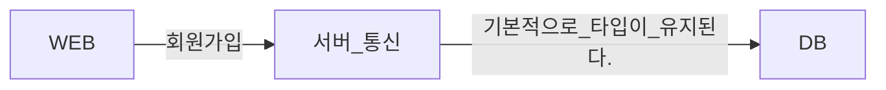
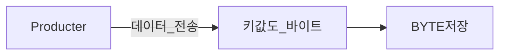
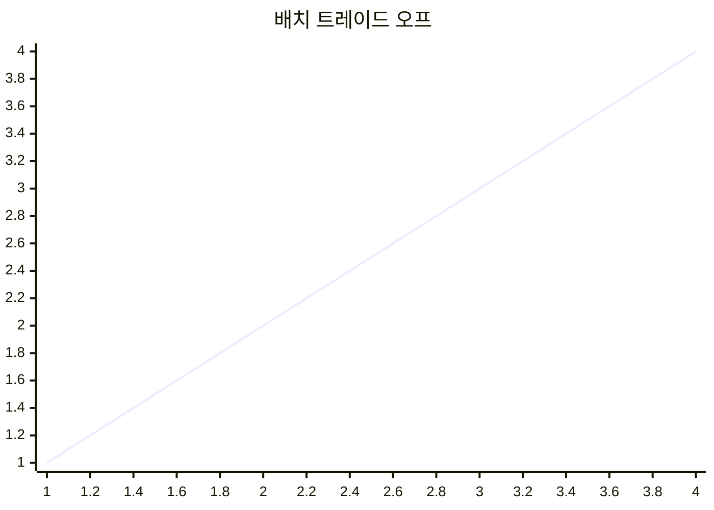
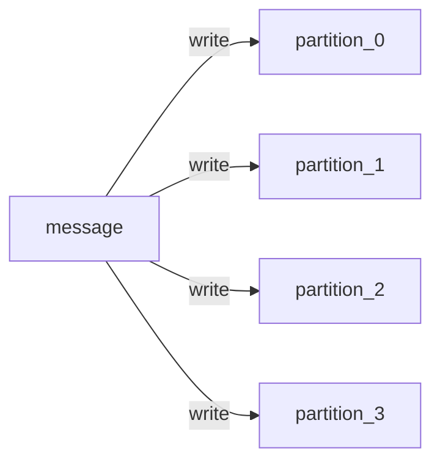
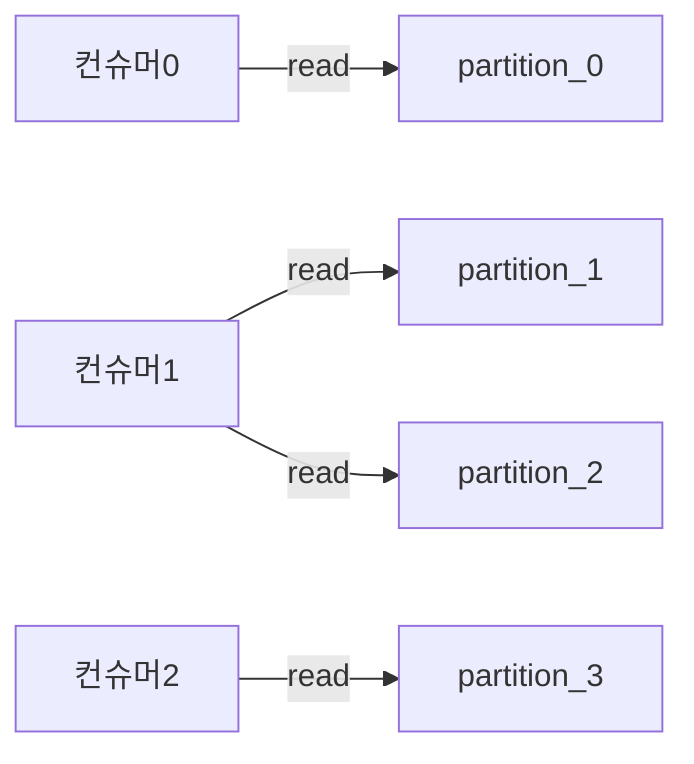
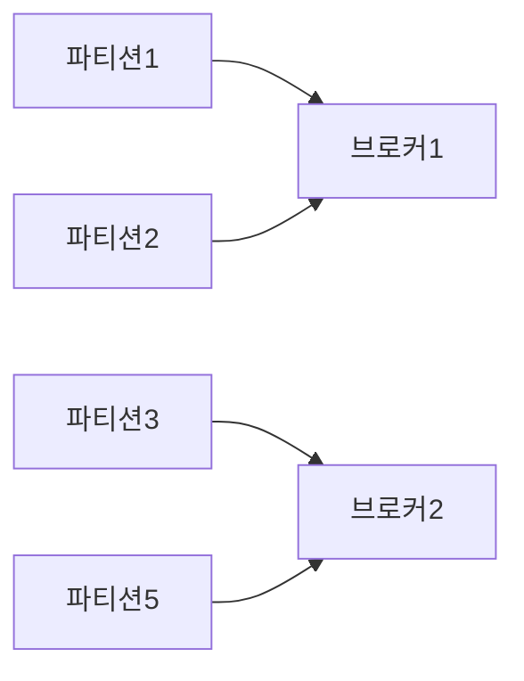
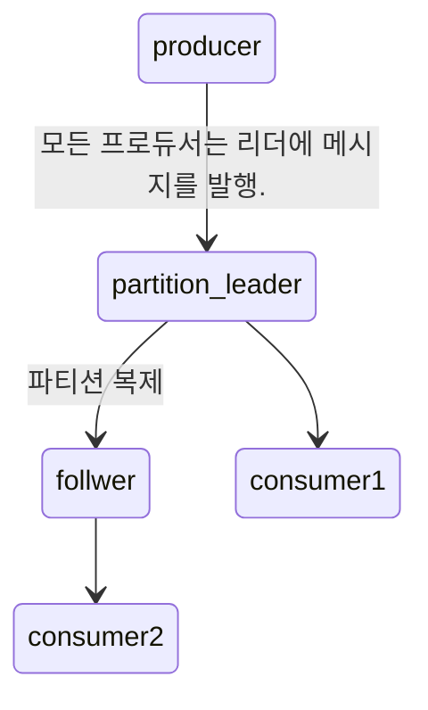

# 카프카 입문
카프카는 여타 DB처럼 시스템 상태의 일관성을 고려하며 고안되었습니다.

카프카에 저장된 데이터는 **순서를 유지**한채로 지속성 있게 보관되며 **결정적(deterministic)**으로 읽을 수 있습니다.

또한, 데이터를 분산시켜 저장할 수 있습니다.

## '결정적으로 읽는다.'이란?

### ChatGPT에서는
>"Kafka에서 deterministic하게 읽는다."는 문장은 Kafka를 사용하여 데이터를 처리할 때 특정한 순서와 일관성을 유지하여 데이터를 읽는 것을 의미합니다. 이는 데이터 손실이나 무작위성 없이, 항상 동일한 결과를 보장하는 것을 의미합니다.

카프카는 여러 프로듀서에서 발생한 데이터들을 받아 컨슈머에게 저장을 하는 구조입니다.

특정 토픽에 대해서 데이터가 들어가게 되면, 카프카에서 자체적인 **규칙**에 의해서 파티션들에 나눠져서 데이터가 **바이트 배열**로 들어가게 될 것입니다.

이 바이트 배열이 불규적으로 입력이 되게 된다면, 컨슈머들이 읽은 데이터를 정상적으로 읽을 수가 없을 것입니다.

>또한, 데이터를 읽을 때 병렬도 되어 있는 파티션들을 읽을 때의 읽는 순서도 중요합니다.
>읽기 관점에서 바라본 것이 'deterministic하게 읽는다.' 라는 말입니다.

# 1.2.1 메시지와 배치
'message'를 관계형 DB의 로우나 레코드와 비슷하게 느낄 수 있습니다.

단지, 카프카의 입장에서는 단순히 바이트의 배열일 뿐입니다.

## DB에 데이터를 넣을 때

## Kafka에 데이터를 넣을 때

> 키는 동일한 키값을 가진 메시지를 동일한 파티션에 저장하는 용도로만 사용된다.

## 저장의 단위는 배치(batch)이다.

배치 크기가 클 수록 시간당 처리되는 메시지의 수는 늘어나지만, 각각의 메시지가 전달되는 데 걸리는 시간은 늘어납니다.

### 당연하지만
- 처리: Producer에서 카프카 partitions으로 보내기 전에 batch로 만드는 과정
- 전달: 만들어진 batch를 broker 서버로 보내는 과정

# 1.2.2 스키마
내용을 이해하기 쉽도록 일정한 구조를 부여하는 것이 권장됩니다.

ex) JSON, XML

그러나, Kafka 개발자들은 apache Avro를 선호합니다.

## 선호하는 이유가 무엇일까?
Avro는 메시지와 스키마를 분리합니다.

Avro가 내부적으로 어떻게 동작되는 지를 아직은 제가 정확하게 알지 못하지만, 제 생각에는 
> 데이터의 **저장**은 여전히 바이트
> 사용자에게 **보여지는** 파일은 스키마의 구조를 띄고 있는

그렇기 때문에, 스키마가 변경되어도 새로운 코드를 생성할 필요가 없다고 생각합니다.

# 1.2.3 토픽과 파티션

카프카에 저장되는 메시지는 **토픽** 단위로 분류됩니다.

메시지가 작성이 되면 하나의 토픽이 다시 여러 개의 파티션으로 나눠져서 저장되는 것을 표현하고 있습니다.

> 파티션 내부에서의 순서는 append-only 형태이기에 순서가 보장이 되지만,
> 전체 토픽에 대한 순서는 보장되지 않습니다.

## 파티션 형태의 저장 장점은?

1. 각 파티션이 서로 다른 서버에 저장될 수 있다.
    - 성능적으로 우수
2. 파티션 별 복제가 가능.
    - 장애에 강해진다.

# 1.2.4. 프로듀서와 컨슈머

## 프로듀서 - 메시지를 생성한다.

메시지는 특정한 토픽에 쓰여지고 기본적으로 파티션들 사이에 고르게 나눠서 쓰지만,

파티셔너(partitioner)를 통해서 키와 키값의 해시를 활용해서 저장되는 파티션을 지정할 수 있다.

## 컨슈머 - 메시지를 읽는다.
> 컨슈머는 1개 이상의 토픽을 구독해서 여기에 저장된 메시지들을 각 파티션에 쓰여진 순서대로 읽어온다.

offset을 활용한다.
offset은 Kafka가 메시지를 저장할 때 각각의 메시지에 부여해주는 또 다른 메타데이터입니다.

이 증가하며 기록되는 메타데이터를 활용해서 컨슈머는 어디까지 읽었는 지를 확실하게 기억할 수 있습니다.

### 컨슈머 그룹

> 컨슈머 그룹은 토픽에 저장된 데이터를 읽어오기 위해 협업하는 하나 이상의 컨슈머로 이루어집니다.

파티션이 하나의 컨슈머에 의해서만 읽히도록 합니다.

이 컨슈머와 파티션의 대응을 **소유권(ownership)**이라고 합니다.

#### 장점
1. 컨슈머들을 수평 확장할 수 있다.
    - 파티션이 많아지면, 그만큼 많은 컨슈머들을 수평적으로 붙여!
2. 장애에 강하다.
    - 컨슈머에 장애가 발생하면, 하나의 컨슈머가 2개의 파티션을 읽을 수 있도록 재할당이 가능하다.

# 1.2.5 브로커와 클러스터

카프카 서버를 **브로커**라고 부릅니다.

브로커는 프로듀서로부터 메시지를 전달받아, 오프셋을 할당 한 뒤 디스크 저장소에 씁니다.
> 카프카는 데이터 스트림 프로그램입니다만, 단순히 데이터를 보내기만 하지는 않습니다.
일정 기간, 일정 용량의 메시지를 저장함으로서, 컨슈머가 예상치 못한 장애로 인해, 데이터를 읽지 못할 경우에 대비할 수 있습니다.

브로커는 컨슈머의 파티션 읽기(fetch) 요청 역시 처리하고 발행된 메시지를 보내줍니다.
> **pull** 방식이라고 합니다.
프로듀서가 브로커에 데이터를 넣는 것은 **push** 방식으로 데이터를 사전에 소통 없이 집어 넣는다고 보면 좋습니다.

## 컨트롤러와 파티션 리더

### 컨트롤러의 역할

카프카 브로커는 클러스터의 일부로서 동작합니다.
클러스터이다 보니, 누군가 하나는 다른 브로커들을 **컨트롤**해야 하는 역할을 맡아야 합니다.

카프카 클러스터는 여러 브로커들 중에 하나가 **컨트롤러**의 역할을 맡게 됩니다.

1. 파티션을 브로커에 할당 해 줍니다.
2. 장애가 발생한 브로커르 모니터링하는 등의 관리 기능을 담당합니다.

### 파티션 리더의 역할

파티션에 장애가 발생할 경우(물론 해당 브로커에 장애가 생길 때도 같음) 대비용. 

> 컨슈머는 리더나 팔로워 중 하나로부터 데이터를 읽어올 수 있습니다.

## 지속성 있게 보관하는 추가 핵심 기능: 보존(retention)

1. 특정 기간 동안 메시지를 보존(7일)
2. 파티션의 크기가 특정 사이즈에 도달할 때까지(1GB)
위 최소한의 설정을 통해서, 지속성을 보존할 수 있습니다.