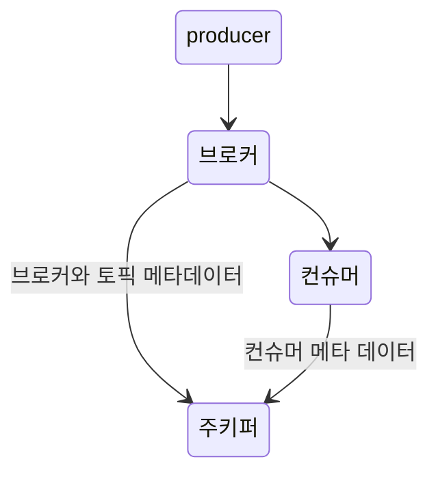

# 사전에 설정해야 하는 프로그램 - 자바와 주키퍼
> 현재 이 자바와 주키퍼를 동작하는 서버는 회사 서버입니다. 책의 순서와 환경이 다를 수도 있습니다.
{: .prompt-warning }

## JDK 설치
주키퍼와 카프카 모두 OpenJDK 기반 자바 구현체에서 원활히 동작합니다. 따라서, 운영체제에 맞는 JDK를 설치해야 합니다.


- .bash_profile 파일에 위와 같은 양식으로 JAVA_HOME을 등록하고 `source ~/.bash_profile`을 통해서 현재 터미널에서 사용 가능하도록 갱신합니다.


## 주키퍼 설치하기
카프카는 카프카 클러스터의 메타데이터와 컨슈머 클라이언트에 대한 정보를 저장하기 위해 아파치 주키퍼를 사용합니다.
> 카프카 배포판에 포함된 스크립트를 사용해서 서버를 띄울 수 있지만, 주키퍼 배포판 풀버전으로 설치를 진행합니다.
{: .prompt-info }

### 주키퍼를 사용하는 이유

> 주키퍼는 설정 정보 관리, 이름 부여, 분산 동기화, 그룹 서비스를 제공하는 중앙화된 서비스입니다.
{: .prompt-info }

### 주키퍼 다운로드
<https://zookeeper.apache.org/releases.html>

<Br>

latest stable release 버전인 3.8.4를 선택했습니다.

> Apache Zookeeper 3.8.4(asc, sha512): 즉시 실행할 수 있는 바이너리 배포본.

>Apache Zookeeper 3.8.4 Source Release: 소스 코드 수정 -> 컴파일 -> Zookeeper 실행

### 설치 위치

설치 위치(압축 해제 위치): `/home/jwjin/kafka/local/zookeeper`{: .filepath}.

저장 위치로 설정 할 위치: `/home/jwjin/kafka/lib/zookeeper`{: .filepath}.

## 주키퍼를 실행해보자.
주키퍼가 실행을 할 때에는 `/conf`디렉토리의 `zoo.cfg` 파일을 읽어서 zookeeper를 실행합니다.

> **아래 내용을 그대로 따라할 경우, 포트 충돌로 인해서 에러가 발생할 수 있습니다. 다 읽고 진행하세요!!!!**
{: .prompt-danger }

```shell
# vim zoo.cfg
tickTime=2000
dataDir = /home/jwjin/kafka/local/zookeeper
clientPort=17630
```
> 회사 서버에서 저에게 할당된 포트가 따로 있습니다. 해당 포트(17630)로 바꾸고 진행을 했습니다.

> ticktTime = 2000이란?:<br>
2초 동안 zookeeper는 **하트 비트 신호**를 보냅니다.<br>
Heartbeat는 노드가 여전히 살아있고 정상적으로 동작 중이라는 것을 알리는 신호입니다.<br>
ticktime은 zookeeper가 heatbeat 신호를 받기 위해 기다리는 최대 시간입니다.
{: .prompt-tip }

### 주키퍼 실행 명령어


```shell
[jwjin@dms156 bin]$ pwd
/home/jwjin/kafka/local/zookeeper/zookeeper/bin
[jwjin@dms156 bin]$ ls
README.txt    zkCli.sh   zkServer-initialize.sh  zkSnapShotToolkit.cmd   zkSnapshotComparer.sh
zkCleanup.sh  zkEnv.cmd  zkServer.cmd            zkSnapShotToolkit.sh    zkTxnLogToolkit.cmd
zkCli.cmd     zkEnv.sh   zkServer.sh             zkSnapshotComparer.cmd  zkTxnLogToolkit.sh
[jwjin@dms156 bin]$ ./zkServer.sh start
/home/jwjin/SmartCEP2.0/appsw/jdk-11.0.16+8/bin/java
ZooKeeper JMX enabled by default
Using config: /home/jwjin/kafka/local/zookeeper/zookeeper/bin/../conf/zoo.cfg
Starting zookeeper ... STARTED

```

#### 통신을 테스트 해봅시다.
```shell
[jwjin@dms156 ~]$ telnet localhost 17630
Trying ::1...
telnet: connect to address ::1: Connection refused
Trying 127.0.0.1...
telnet: connect to address 127.0.0.1: Connection refused

```
>응답을 받지를 않습니다.

#### 실행 확인
```shell
[jwjin@dms156 bin]$ ./zkServer.sh status
/home/jwjin/SmartCEP2.0/appsw/jdk-11.0.16+8/bin/java
ZooKeeper JMX enabled by default
Using config: /home/jwjin/kafka/local/zookeeper/zookeeper/bin/../conf/zoo.cfg
Client port found: 17630. Client address: localhost. Client SSL: false.
Error contacting service. It is probably not running.
```
> 실행이 되어 있는 상태가 아닙니다. 가장 유력한 후보는 포트 충돌입니다.
그러나, 우리는 포트 설정을 한 기억이 있습니다. **무엇인가 추가 설정을 해야 할까요?**

#### 로그를 확인해 봅시다.
로그 파일 위치: `/home/jwjin/kafka/local/zookeeper/zookeeper/logs`{: .filepath}.
```shell
2024-04-07 15:36:17,789 [myid:] - ERROR [main:o.a.z.s.ZooKeeperServerMain@86] - Unable to start AdminServer, exiting abnormally
org.apache.zookeeper.server.admin.AdminServer$AdminServerException: Problem starting AdminServer on address 0.0.0.0, port 8080 and command URL /commands
	at org.apache.zookeeper.server.admin.JettyAdminServer.start(JettyAdminServer.java:194)
	at org.apache.zookeeper.server.ZooKeeperServerMain.runFromConfig(ZooKeeperServerMain.java:155)
	at org.apache.zookeeper.server.ZooKeeperServerMain.initializeAndRun(ZooKeeperServerMain.java:113)
	at org.apache.zookeeper.server.ZooKeeperServerMain.main(ZooKeeperServerMain.java:68)
	at org.apache.zookeeper.server.quorum.QuorumPeerMain.initializeAndRun(QuorumPeerMain.java:141)
	at org.apache.zookeeper.server.quorum.QuorumPeerMain.main(QuorumPeerMain.java:91)
Caused by: java.io.IOException: Failed to bind to /0.0.0.0:8080
	at org.eclipse.jetty.server.ServerConnector.openAcceptChannel(ServerConnector.java:349)
	at org.eclipse.jetty.server.ServerConnector.open(ServerConnector.java:310)
	at org.eclipse.jetty.server.AbstractNetworkConnector.doStart(AbstractNetworkConnector.java:80)
	at org.eclipse.jetty.server.ServerConnector.doStart(ServerConnector.java:234)
	at org.eclipse.jetty.util.component.AbstractLifeCycle.start(AbstractLifeCycle.java:73)
	at org.eclipse.jetty.server.Server.doStart(Server.java:401)
	at org.eclipse.jetty.util.component.AbstractLifeCycle.start(AbstractLifeCycle.java:73)
	at org.apache.zookeeper.server.admin.JettyAdminServer.start(JettyAdminServer.java:185)
	... 5 common frames omitted
Caused by: java.net.BindException: 주소가 이미 사용 중입니다
	at java.base/sun.nio.ch.Net.bind0(Native Method)
	at java.base/sun.nio.ch.Net.bind(Net.java:459)
	at java.base/sun.nio.ch.Net.bind(Net.java:448)
	at java.base/sun.nio.ch.ServerSocketChannelImpl.bind(ServerSocketChannelImpl.java:227)
	at java.base/sun.nio.ch.ServerSocketAdaptor.bind(ServerSocketAdaptor.java:80)
	at org.eclipse.jetty.server.ServerConnector.openAcceptChannel(ServerConnector.java:344)
	... 12 common frames omitted
Unable to start AdminServer, exiting abnormally
2024-04-07 15:36:17,790 [myid:] - INFO  [main:o.a.z.a.ZKAuditProvider@42] - ZooKeeper audit is disabled.
2024-04-07 15:36:17,792 [myid:] - ERROR [main:o.a.z.u.ServiceUtils@48] - Exiting JVM with code 4

```
무엇인가 보이시나요? 중요한 부분만 뽑아서 다시 보겠습니다.

```shell
2024-04-07 15:36:17,789 [myid:] - ERROR [main:o.a.z.s.ZooKeeperServerMain@86] - Unable to start AdminServer, exiting abnormally
org.apache.zookeeper.server.admin.AdminServer$AdminServerException: Problem starting AdminServer on address 0.0.0.0, port 8080 and command URL /commands

Caused by: java.net.BindException: 주소가 이미 사용 중입니다

```
> AdminServer가 무엇이죠???

## 주키퍼의 구조:

### 참고 사이트:
https://unagi44.wordpress.com/2015/09/24/zookeeper-cluster/

https://dev-youngjun.tistory.com/176

http://www.liferaysavvy.com/2021/07/setup-zookeeper-cluster.html

***

기본적으로 메인은 Kafka이므로 간단하게 기록하고 넘어가겠습니다.

#### AdminServer

#### Zookeeper Cluster 구조

#### Port 사용의 예시

> 책에서는 'Quorum Port'를 'PeerPort'로 명명하고 있습니다.
{: .prompt-info }


>`server.{X}={hostname}:{peerPort}:{leaderPort}`

***
Zookeeper는 주키퍼 Server간 클러스터를 기능을 제공합니다.

그리고 주키퍼는
- zookeeper들을 관리하기 위한 AdminServer Port
- Leader 선출을 위한 포트
- Server 간 데이터 이동을 위한 포트
- Server와 Client간 데이터 이동 포트

> 추가 설정을 하지 않으면, zookeeper들을 관리하기 위한 AdminServer 기능이 default로 On되고 8080 포트를 사용합니다.

>AdminServer는 주로 주키퍼 클러스터를 관리하고 모니터링하기 위해 사용되는 포트입니다. **지금 저는 주키퍼들을 관리하는 AdminServer Port의 역할이 필요하지 않습니다.** 따라서, 기능을 OFF 하기 위한 설정을 추가합니다.

## zoo.cfg 수정하자.

### 기존
```shell
# vim zoo.cfg
tickTime=2000
dataDir = /home/jwjin/kafka/local/zookeeper
clientPort=17630
```
### 변경
```shell
# vim zoo.cfg
tickTime=2000
dataDir = /home/jwjin/kafka/local/zookeeper
clientPort=17630

admin.enableServer=false
```

## 실행 확인

### 실행 명령어
```shell

[jwjin@dms156 bin]$ ./zkServer.sh start
/home/jwjin/SmartCEP2.0/appsw/jdk-11.0.16+8/bin/java
ZooKeeper JMX enabled by default
Using config: /home/jwjin/kafka/local/zookeeper/zookeeper/bin/../conf/zoo.cfg
Starting zookeeper ... STARTED

[jwjin@dms156 bin]$ ./zkServer.sh status
/home/jwjin/SmartCEP2.0/appsw/jdk-11.0.16+8/bin/java
ZooKeeper JMX enabled by default
Using config: /home/jwjin/kafka/local/zookeeper/zookeeper/bin/../conf/zoo.cfg
Client port found: 17630. Client address: localhost. Client SSL: false.
Mode: standalone

```
### 호출해봅시다.
```shell

[jwjin@dms156 ~]$ telnet localhost 17630
Trying ::1...
Connected to localhost.
Escape character is '^]'.
srvr
Zookeeper version: 3.8.4-9316c2a7a97e1666d8f4593f34dd6fc36ecc436c, built on 2024-02-12 22:16 UTC
Latency min/avg/max: 0/0.0/0
Received: 2
Sent: 1
Connections: 1
Outstanding: 0
Zxid: 0x8d
Mode: standalone
Node count: 134

```
주키퍼에 대한 기본 정보를 리턴받을 수 있습니다.

### 주키퍼 클러스터링을 할 시 추가할 수 있는 옵션들

```shell
# 팔로워가 리더와의 연결할 수 있는 최대 시간 - 초기화 제한 시간
initLimit = 20

# 팔로워가 리더와 연결할 수 있는 최대 시간 - 동기화 제한 시간
syncLimit = 5

```

