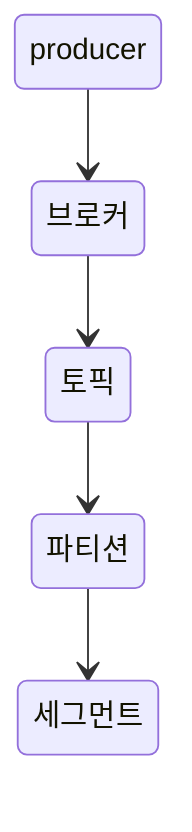

단일 서버에서 단독으로 실행되는 브로커가 아니라 클러스터 모드로 작동시키라면, 기본 값이 아닌 다른 값으로 바꿔줘야 합니다.

## broker.id


`카프카 브로커는 정숫값 식별자`를 갖습니다. `broker.id`로 설정 가능한다.
> 중요한 것은 이 정숫값이 클러스터 안의 각 브로커별로 전부 달라야 한다는 점이다.
각 호스트 별로 고정된 값을 사용하는 것이 강력하게 권장됩니다.(서로 id값이 겹치지 않게)

## listeners

새로 도입된 listeners 설정은 쉼표로 구분된 리스너 이름과 URL의 목록입니다.

일반적인 보안 프로토콜이 아니라면, `listener.security.protocol.map` 설정을 잡아야 한다.

> 리스너는 {프로토콜}`://{호스트 이름}:{포트}의 형태로 정의됩니다.
PLANTEXT://localhost:9092, SSL://9091

1024미만의 포트들은 루트 권한으로 카프카를 생행시켜야 하기에 바람직하지 않습니다.

## zookeeper.connect


메타데이터가 저장되는 주키퍼의 위치를 가리킵니다.
로컬 호스트에서 동작 중인 주키퍼를 사용할 경우 해당 위치를 입력을 하면 됩니다.

## log.dirs


- log_dir: 모든 메시지를 로그 세그먼트 단위로 묶어서 설정된 디스크 디렉토리에 저장합니다.
단  하나의 디렉토리를 이용해서 저장할 경우, log,dir를 활용하면 됩니다.

- log_dirs: 1개 이상의 디렉토리에 로그를 저장하고자 할 경우, 위 옵션을 활용합니다.
브로커는 디렉토리 중에서, 가장 적은 파티션 수를 저장한 디렉터리에 새로운 로그를 저장하므로 균등 데이터를 보장하지는 않습니다.

## num.recovery.threads.per.data.dir


카프카는 설정 가능한 스레드 풀을 사용해서 로그 세그먼트를 관리합니다.

### 스레드 풀과 로그 세그먼트가 무엇이지?
- 매우 도움이 된 사이트: https://colevelup.tistory.com/18

#### 스레드 풀
카프카에서의 "스레드 풀(Thread Pool)"은 메시지 처리 작업을 비동기적으로 수행하기 위한 메커니즘입니다.

이 비동기적으로 작동하는 스레드가 `로그 세그먼트`를 관리합니다.

#### 세그먼트란?


> 각 메시지들은 세그먼트라는 로그 파일의 형태로 브로커의 로컬 디스크에 저장됩니다.


#### 세그먼트 확인


```shell
./kafka-topics.sh --bootstrap-server localhost:17631 -create -replication-factor 1 -partitions 1 --topic test

```
> 처음에 토픽을 생성할 때 `partitions 1`로 설정을 했기에 `test-0` 하나의 디렉토리만 만들어져 있다.

#### 세그먼트 폴더 확인


- .index: 로그 세그먼트에 저장된 위치와 offset 정보

- .log: 실제 메시지들이 저장되는 파일

- .timeindex: 메시지들의 타임스탬프를 기록하는 파일

> 
이러한 세그먼트들이 모여있으면서, 메시지의 내용만 저장되는 것이 아니라 메시지의 key, value, offset, message size와 같은 정보가 함께 저장하는 것이 `로그 세그먼트` 입니다.
{: .prompt-tip }


### 설정

- 브로커가 정상적으로 시작되었을 때, 각 파티션읠 `로그 세그먼트 파일을 연다.`

- 장애 발생 후 다시 시작할 때, 각 파티션의 로그 세그먼트를 `검사`하고 잘못된 부분은 `삭제`한다.

- 브로커가 종료될 때, 로그 세그먼트를 정상적으로 닫는다.

`num.recovery.threads.per.data.dir`은 로그 디렉토리별 스레드 수 입니다.

`log.dirs`에 지정된 경로수가 3이고 `num.recovery.threads.per.data.dir`이 8이라면 전체 스레드 수는 24가 됩니다.

## auto.create.topics.enable


> 기본적으로 카프카는 아래와 같은 상황에서 토픽을 자동으로 생성하도록 되어 있습니다.
> - 프로듀서가 토픽에 메시지를 쓰기 시작할때
> - 컨슈머가 메시지를 읽기 시작할 때
> - 클라이언트가 토픽에 대한 메타데이터를 요청할 때

### 발생하는 문제점
카프카에서 토픽을 생성하지 않고 존재 여부만을 확인할 방법이 없다는 것이 가장 큰 문제입니다.

따라서, 명시적으로 관리하고자 할 경우

`auto.create.topics.enable=false` 로 놓아야 합니다.

## auto.leader.rebalance.enable
모든 토픽의 리더 역할이 하나의 브로커에 집중된다면 카프카 클러스터의 균형이 깨질 수가 있습니다.

그래서, 주기적으로 분표 상태를 확인(`leader.imbalance.check.interval.seconds`)하여 특정 브로커의 리더 역할이 할당된 파티션의 비율이 `leader.imbalance.per.broker.percentage`에 설정된 값을 넘어가면 파티션의 선호 리더(preferred leader) 리밸런싱이 발생합니다.

## delete.topic.enable
토픽 삭제 기능 방지 옵션


