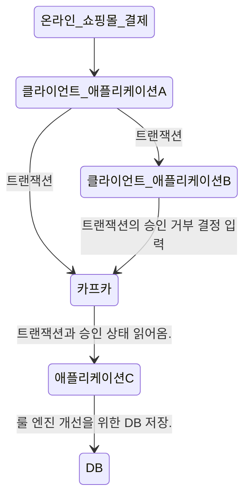
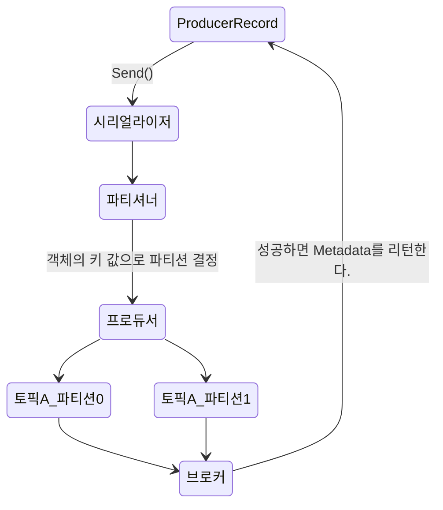

## 카프카 애플리케이션 흐름


아파치 카프카는 개발자들이 상호작용 할 수 있는 애플리케이션을 개발할 때 사용할 수 있는 클라이언트 API와 함께 배포를 하고 있습니다.

## 3.1 프로듀서 개요

서로 다른 요구 조건에 따라, 카프카에 메시지를 쓰지 위한 프로듀서 API를 사용하는 방식에 차이가 발생합니다.
ex) 카드사, 클릭 정보 수집.

### 카프카 API의 주요 단계

- 카프카에 메시지를 쓰는 과정은 ProducerRecord 객체를 생성하면서 시작됩니다.

- ProducerRecord 객체는 토픽, 밸류 값은 필수 사항이지만, 키, 파티션은 선택 사항입니다.

- 프로듀서는 파티셔너에 의해서(혹은 ProducerRecord에서) 결정된 토픽과 파티션을 기준으로 각각의 파티션으로 전송될 레코드들을 모은 `레코드 배치`에 추가하고 브로커에 전송합니다.

- 성공적으로 데이터가 전송이 될 경우, RecordMetaData를 리턴하고 실패할 경우 에러가 리턴됩니다.


## 3.2 카프카 프로듀서 생성하기

### 필수 속성 값

#### bootstrap.servers
- 카프카 클러스터와 `첫 연결`을 생성하기 위해 프로듀서가 사용할 브로커의 host:port 값.
- 모든 브로커를 다 연결할 필요가 없다. 이유는 첫 연결 후 `추가 정보`를 리턴을 받기 때문입니다.
- 다만, 브로커 중 하나가 작동을 정지하는 경우에도 동작할 수 있도록 최소 2개 이상을 지정할 것을 권장합니다.

#### key.serializer
- 카프카에 쓸 레코드의 키의 값을 직렬화하기 위해 사용하는 시리얼라이저 클래스의 이름입니다.
- 기본적으로 카프카는 `바이트 배열`로 데이터를 받습니다.
- 그러나, 프로듀서 인터페이스는 임의의 `자바 객체를 키 혹은 밸류로 전송`할 수 있도록 매개변수화 된 타입을 사용할 수 있게 합니다.

#### value.serializer
위와 동일한 개념.


### 카프카 연결만
https://kafka.apache.org/23/javadoc/index.html?org/apache/kafka/clients/producer/KafkaProducer.html

```java
public class example {

	public static void main(String[] args) {
		 // Kafka 브로커에 연결할 설정 추가
        Properties kafkaProps = new Properties();
        kafkaProps.put("bootstrap.servers", "{외부IP}:17633"); // Kafka host 및 server 설정
        kafkaProps.put("key.serializer", "org.apache.kafka.common.serialization.StringSerializer");   // serialize 설정
        kafkaProps.put("value.serializer", "org.apache.kafka.common.serialization.StringSerializer"); // serialize 설정

        // producer 생성
        KafkaProducer<String, String> producer = new KafkaProducer<String, String>(kafkaProps);


	}

}
```

