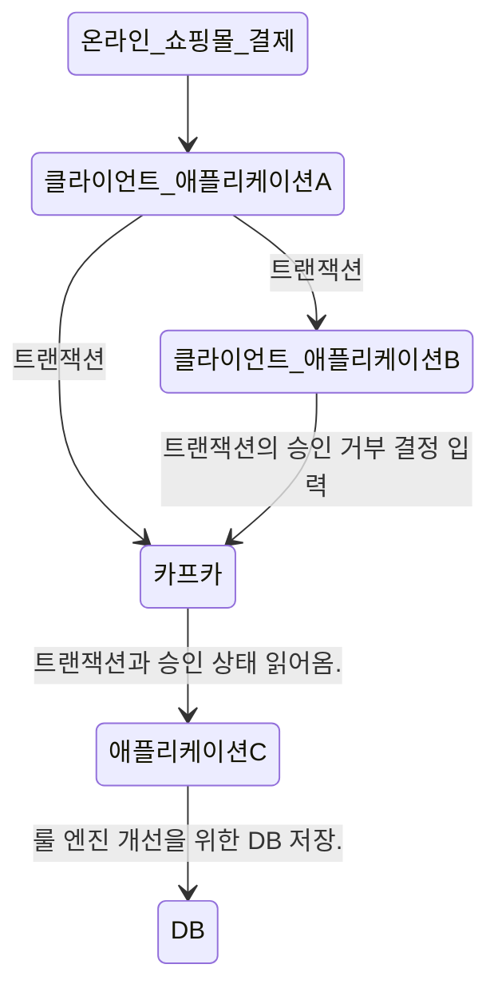
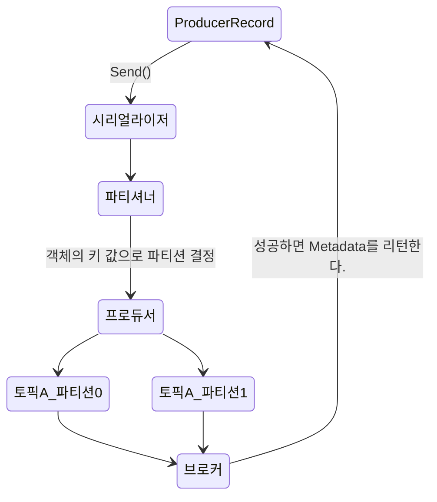

# 개요

카프카를 큐로서 사용하든, 메시지 버스나 데이터 저장 플랫폼으로 사용하든 간에 카프카에 데이터를 쓸 때 사용하는 프로듀서나 읽어 올때 사용하는 컨슈머, 혹은 두 가지 기능 모두를 수행하는 애플리케이션을 수행해야 한다.

> 이걸 사용하지 않으면, 쉘 스크립트를 통해서 혹은 터미널 명령어를 통해서 message를 보내야 할 것이라고 생각하니, 필수라는 생각이 자연스럽게 들었습니다.

## 카프카 애플리케이션 흐름


아파치 카프카는 개발자들이 상호작용 할 수 있는 애플리케이션을 개발할 때 사용할 수 있는 클라이언트 API와 함께 배포를 하고 있습니다.

## 3.1 프로듀서 개요

서로 다른 요구 조건에 따라, 카프카에 메시지를 쓰지 위한 프로듀서 API를 사용하는 방식에 차이가 발생합니다.
ex) 카드사, 클릭 정보 수집.

> 결국 중요한 것은 카프카라는 도구를 어떻게 사용할 것인가?

### 카프카 API의 주요 단계

- 카프카에 메시지를 쓰는 과정은 ProducerRecord 객체를 생성하면서 시작됩니다.

- ProducerRecord 객체는 토픽, 밸류 값은 필수 사항이지만, 키, 파티션은 선택 사항입니다.

- 프로듀서는 파티셔너에 의해서(혹은 ProducerRecord에서) 결정된 토픽과 파티션을 기준으로 각각의 파티션으로 전송될 레코드들을 모은 `레코드 배치`에 추가하고 브로커에 전송합니다.

- 성공적으로 데이터가 전송이 될 경우, 브로커는 해당 파티션 안에서의 레코드의 오프셋을 담은 'RecordMetaData'를 리턴하고 실패할 경우 에러가 리턴됩니다.

## 3.2 카프카 프로듀서 생성하기

### 필수 속성 값

#### bootstrap.servers
- 카프카 클러스터와 `첫 연결`을 생성하기 위해 프로듀서가 사용할 브로커의 host:port 값.
- 모든 브로커를 다 연결할 필요가 없다. 이유는 첫 연결 후 `추가 정보`를 리턴을 받기 때문입니다.
- 다만, 브로커 중 하나가 작동을 정지하는 경우에도 동작할 수 있도록 최소 2개 이상을 지정할 것을 권장합니다.

#### key.serializer
- 카프카에 쓸 레코드의 키의 값을 직렬화하기 위해 사용하는 시리얼라이저 클래스의 이름입니다.
- 기본적으로 카프카는 `바이트 배열`로 데이터를 받습니다.
- 프로듀서 인터페이스는 임의의 `자바 객체를 키 혹은 밸류로 전송`할 수 있도록 매개변수화 된 타입을 사용할 수 있게 합니다.
> 코드의 가독성이 매우 높아지게 됩니다.

#### value.serializer
위와 동일한 개념.


### 카프카 연결만
https://kafka.apache.org/23/javadoc/index.html?org/apache/kafka/clients/producer/KafkaProducer.html

```java
import java.util.Properties;

public class example {

	public static void main(String[] args) {
		 // Kafka 브로커에 연결할 설정 추가
        Properties kafkaProps = new Properties();
        kafkaProps.put("bootstrap.servers", "{외부IP}:17633"); // Kafka host 및 server 설정
        kafkaProps.put("key.serializer", "org.apache.kafka.common.serialization.StringSerializer");   // serialize 설정
        kafkaProps.put("value.serializer", "org.apache.kafka.common.serialization.StringSerializer"); // serialize 설정

        // producer 생성
        KafkaProducer<String, String> producer = new KafkaProducer<String, String>(kafkaProps);


	}

}
```
> 살펴보면, Properties에 Producer 속성 값들을 key-value 형태로 넣고 KafkaProducer 객체에 속성값으로 집어 넣는 것을 확인할 수 있습니다.

```shell

10:44:15.533 [main] INFO org.apache.kafka.clients.producer.KafkaProducer -- [Producer clientId=producer-1] Instantiated an idempotent producer.
10:44:15.611 [main] INFO org.apache.kafka.common.utils.AppInfoParser -- Kafka version: 3.6.1
10:44:15.612 [main] INFO org.apache.kafka.common.utils.AppInfoParser -- Kafka commitId: 5e3c2b738d253ff5
10:44:15.612 [main] INFO org.apache.kafka.common.utils.AppInfoParser -- Kafka startTimeMs: 1713923055610

```
> producer에 대한 정보, API에 대한 정보만 콘솔창에 뜨는 것을 확인할 수 있습니다.
> 위 설정들을 통해서, 프로듀서를 실행을 제어할 수 있는 것을 알게 되었습니다.

## 3.3 카프카로 메시지를 전달하기

### 메시지 전송 방법

1. 파이어 앤 포켓
- 메시지를 서버에 전송만 하고 성공 혹은 실패 여부를 신경 쓰지 않는다.
- 기본적으로 실패한 메시지를 재전송을 시도하기에 대부분의 경우는 성공적으로 전달됩니다.
- > 그러나, 재시도를 할 수 없는 에러, 타임아웃이 발생하면 애플리케이은 아무런 정보나 예외를 전달받지 않습니다.
{: .prompt-warning }

2. 동기적 전송
- 카프카 프로듀서는 언제나 비동기적으로 작동합니다.
a. `Send()` 매서드는 `Future 객체`를 리턴합니다.
b. 다음 메시지를 전송하기 전에 `get()` 메서드를 호출해서 작업이 완료될 때까지 기다렸다가 실제 성공 여부를 확인합니다.

3. 비동기적 전송
- 콜백 함수와 함께 send() 메서드를 호출하면 카프카 브로커로부터 응답을 받는 시점에서 자동으로 콜백 함수가 호출됩니다.

> 콜백 함수란?
> 콜백(callback) 함수는 간단히 말하면 매개변수로 함수 객체를 전달해서 호출 함수 내에서 매개변수 함수를 실행하는 것을 말합니다.
> https://inpa.tistory.com/entry/JS-%F0%9F%93%9A-%EC%9E%90%EB%B0%94%EC%8A%A4%ED%81%AC%EB%A6%BD%ED%8A%B8-%EC%BD%9C%EB%B0%B1-%ED%95%A8%EC%88%98
{: .prompt-info }

#### 카프카 전송 예시
```java

package kafka;
import org.apache.kafka.clients.admin.AdminClient;
import org.apache.kafka.clients.admin.NewTopic;
import org.apache.kafka.clients.producer.KafkaProducer;
import org.apache.kafka.clients.producer.ProducerRecord;

import java.util.Collections;
import java.util.Properties;

public class producer3 {

	public static void main(String[] args) {
		 // Kafka 브로커에 연결할 설정 추가
        Properties configs = new Properties();
        configs.put("bootstrap.servers", "{외부IP}"); // Kafka host 및 server 설정
        configs.put("acks", "all");                         // 자신이 보낸 메시지에 대해 카프카로부터 확인을 기다리지 않습니다.
        configs.put("block.on.buffer.full", "true");        // 서버로 보낼 레코드를 버퍼링 할 때 사용할 수 있는 전체 메모리의 바이트수
        configs.put("spring.kafka.producer.properties.security.protocol", "PLAINTEXT"); 
        configs.put("key.serializer", "org.apache.kafka.common.serialization.StringSerializer");   // serialize 설정
        configs.put("value.serializer", "org.apache.kafka.common.serialization.StringSerializer"); // serialize 설정

        
        // producer 생성
        KafkaProducer<String, String> producer = new KafkaProducer<String, String>(configs);

                
        
        // 토픽 생성 요청
        AdminClient adminClient = AdminClient.create(configs);
        NewTopic newTopic = new NewTopic("Customer3", 1, (short) 1); // 이름, 파티션 수, 복제 팩터
        adminClient.createTopics(Collections.singletonList(newTopic));
        
        // ProducerRecord 생성
        ProducerRecord<String, String> record = new ProducerRecord<>("Customer3", "Precision Products", "France");
        
        
        try {
       	producer.send(record);
        	
        }catch(Exception e) {
        	e.printStackTrace();
        }

        // 종료
        producer.flush();
        producer.close();

	}

}

```

#### ProducerRecord

1. 프로듀서는 ProducerRecord 객체를 받으므로 `ProducerRecord를 생성`하는 것부터 시작해야 합니다.
ProducerRecord 클래스에는 생성자가 여러 개 있습니다.
예시 코드에서는 토픽 이름과 키, 밸류값을 사용하는 생성자를 사용했지만, `다른 형태로 ProducerRecord 객체를 생성`이 가능하다는 것을 의미합니다.

2. ProducerRecord를 전송하기 위해 프로듀서 객체의 `send` 메서드를 사용합니다. RecordMetaData를 포함한 자바 Future 객체를 리턴하지만, 리턴값을 무시하기에 성공 여부를 파악할 수가 없습니다.
> message를 보내는 send 매서드는 producer에 있고 producer의 매개변수로 ProducerRecord 객체를 매개변수로 받아 전송합니다.
> 파할 수 없는 이유는 send()만 하기 때문입니다.

3. 프로듀서가 카프카로 메시지를 보내기 전의 에러를 감지하기 위한 try~catch
        - SerializationException: 메시지를 직렬화하는 데 실패
        - TimeoutException: 버퍼가 가득 찰 경우
        - InterruptionException: 전송 작업을 수행하는 스레드에 인터럽트가 걸릴 경우.

#### 실행 예시

##### kafka 구동

```shell
./kafka-server-start.sh -daemon /home/jwjin/kafka/kafkaConfig/server.properties

```
##### 에러
> server.properties에서 설정값으로 인해서 오류가 발생했습니다. 임시로 주석 처리했습니다.

```shell
# 토픽 자동 생성 옵션 - 아래를 주석처리하고 다시 실행해보았습니다.
auto.create.topics.enable=false 
```

##### Spring console

```shell

15:08:43.067 [main] INFO org.apache.kafka.clients.producer.KafkaProducer -- [Producer clientId=producer-1] Instantiated an idempotent producer.
15:08:43.147 [main] INFO org.apache.kafka.common.utils.AppInfoParser -- Kafka version: 3.6.1
15:08:43.149 [main] INFO org.apache.kafka.common.utils.AppInfoParser -- Kafka commitId: 5e3c2b738d253ff5
15:08:43.149 [main] INFO org.apache.kafka.common.utils.AppInfoParser -- Kafka startTimeMs: 1713938923146
15:08:43.565 [kafka-producer-network-thread | producer-1] WARN org.apache.kafka.clients.NetworkClient -- [Producer clientId=producer-1] Error while fetching metadata with correlation id 1 : {CustomerCountry=LEADER_NOT_AVAILABLE}
15:08:43.567 [kafka-producer-network-thread | producer-1] INFO org.apache.kafka.clients.Metadata -- [Producer clientId=producer-1] Cluster ID: x1VBUZHzQf-B48WtMcq_Qw
15:08:43.707 [kafka-producer-network-thread | producer-1] INFO org.apache.kafka.clients.producer.internals.TransactionManager -- [Producer clientId=producer-1] ProducerId set to 13000 with epoch 0

```

##### 적제 확인

```shell
[jwjin@dms156 kafkaBin]$ ./kafka-console-consumer.sh --bootstrap-server {외부IP}:17633 --topic CustomerCountry --from-beginning
France
```
> value 값이 적재 된 것을 확인할 수 있습니다.

### 3.3.1 동기적으로 메시지 전달하기

브로커가 쓰기 요청에 에러 응답을 내놓거나 재전송 횟수가 소진되었을 대 발생되는 에러를 처리할 수 있다.
> 동기적이니, 브로커에서의 에러를 읽거나 대처할 수 있는 순서가 보장 되어집니다.

그러나, 동기적이니 전송을 요청하는 스레드는 응답때까지 아무것도 하지 않고 기다리기에 실제로 사용되는 애플리케이션에서는 잘 사용되지 않습니다.

```java
        
        ProducerRecord<String, String> record = new ProducerRecord<>("CustomerCountry", "Precision Products", "France");
        
        try {
       	producer.send(record).get();
        	
        }catch(Exception e) {
        	e.printStackTrace();
        }

```
> 가장 큰 차이점은 `producer.send(record).get()`에서 `get()`이 추가된 점입니다.
> <strong>즉, 카프카로부터 return 받은 객체의 get() 매서드를 실행해야 한다. -> 기다린다. -> 동기다.</strong>
> get() 매서드는 Future.get() 매서드입니다. 성공적으로 카프카에 전송이 되지 않을 경우 get() 매서드에서 예외가 발생됩니다.
> 물론, 예외가 발생되지 않을 경우, RecordMetaData 객체를 리턴하게 됩니다.

### 3.3.2 비동기적으로 메시지 전송하기

대부분의 애플리케이션에서는 메타데이터가 필요 없기에 동기적으로 메시지를 전송할 이유가 없다.

반대로, 메시지를 전송에 실패할 경우에는 그런 내용을 알아야 합니다.

`그래야 예외를 발생시키든지, 에러를 로그에 쓰든지, 사후 분석을 위해 에러 파일에 메시지를 쓰거아 할 수 있습니다.`

#### 콜백 함수

```java
package new_book;

import org.apache.kafka.clients.producer.Callback;
import org.apache.kafka.clients.producer.RecordMetadata;

class DemoProducerCallback implements Callback {

	@Override
	public void onCompletion(RecordMetadata recordMetadta, Exception e) {
		if (e != null) {
			e.printStackTrace();
		}
	}
}

```

> 기본적으로 브로커에서 어플리케이션에게 RecordMetaData를 전송합니다.
> 그 상황에서 카프카에서 에러를 리턴하면, 즉 Exception e의 값이 있다면, 에러를 처리할 수 있도록 해야 합니다.

#### 비동기 통신 프로듀서 코드

```java

public class asyncMessage {

	public static void main(String[] args) {
		 // Kafka 브로커에 연결할 설정 추가
        Properties configs = new Properties();
        configs.put("bootstrap.servers", "{외부IP}"); // Kafka host 및 server 설정
        configs.put("acks", "all");                         // 자신이 보낸 메시지에 대해 카프카로부터 확인을 기다리지 않습니다.
        configs.put("block.on.buffer.full", "true");        // 서버로 보낼 레코드를 버퍼링 할 때 사용할 수 있는 전체 메모리의 바이트수
        configs.put("spring.kafka.producer.properties.security.protocol", "PLAINTEXT"); 
        configs.put("key.serializer", "org.apache.kafka.common.serialization.StringSerializer");   // serialize 설정
        configs.put("value.serializer", "org.apache.kafka.common.serialization.StringSerializer"); // serialize 설정

        
        // producer 생성
        KafkaProducer<String, String> producer = new KafkaProducer<String, String>(configs);

                
        
        // 토픽 생성 요청
        AdminClient adminClient = AdminClient.create(configs);
        NewTopic newTopic = new NewTopic("Customer3", 1, (short) 1); // 이름, 파티션 수, 복제 팩터
        adminClient.createTopics(Collections.singletonList(newTopic));
        
        // ProducerRecord 생성
        ProducerRecord<String, String> record = new ProducerRecord<>("Customer3", "Biomeidcal Materials", "USA");
        
        
        try {
       	producer.send(record, new DemoProducerCallback());
        	
        }catch(Exception e) {
        	e.printStackTrace();
        }

        // 종료
        producer.flush();
        producer.close();

	}

}
```

