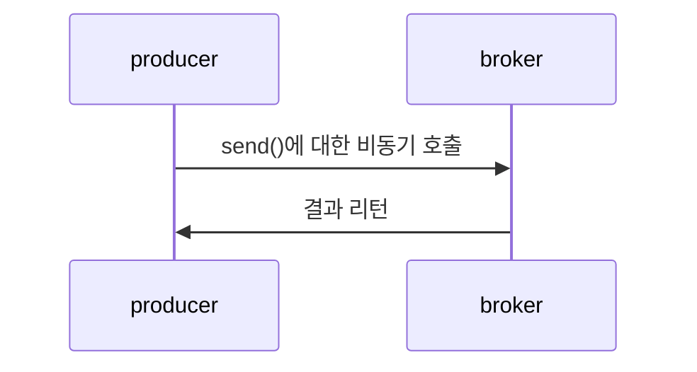
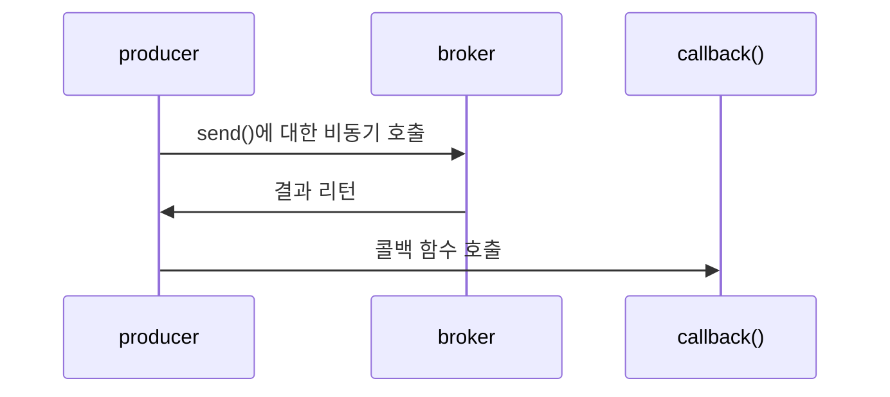
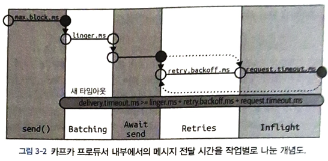
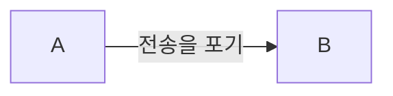

https://kafka.apache.org/documentation/#design_quotasgroups

## 3.4.1 client.id
프로듀서와 그것을 사용하는 애플리케이션을 구분하기 위한 논리적 식별자.

트러블 슈팅이 쉽게 해준다.
> "IP: 104.27.155.134에서 인증 실패가 나온다."
> 주문 확인 서비스에서 문제가 발생하고 있다.


```java

        Properties configs = new Properties();
        configs.put("bootstrap.servers", "61.33.35.156:17633"); // Kafka host 및 server 설정
        configs.put("acks", "all");                         // 자신이 보낸 메시지에 대해 카프카로부터 확인을 기다리지 않습니다.
        configs.put("block.on.buffer.full", "true");        // 서버로 보낼 레코드를 버퍼링 할 때 사용할 수 있는 전체 메모리의 바이트수
        configs.put("spring.kafka.producer.properties.security.protocol", "PLAINTEXT"); 
        configs.put("key.serializer", "org.apache.kafka.common.serialization.StringSerializer");   // serialize 설정
        configs.put("value.serializer", "org.apache.kafka.common.serialization.StringSerializer"); // serialize 설정
        configs.put("client.id", "producerWithClientId");
```
> 실제 서버에서 `producerWithClientId` 라는 이름으로 적재되는 것을 확인하고 싶었으나, 로그가 안보여서 PASS

## 3.4.2 acks
The number of acknowledgments the producer requires the leader to have received before considering a request complete.

> 프로듀서가 얼마나 많은 acknowledgments들을 요구하는지, 설정합니다.

### acks=0
> 난 모든 ack들을 받지 않을 겁니다.

프로듀서는 메시지가 성공적으로 전달되었다고 간주하고 브로커의 응답을 기다리지 않을 겁니다.

그렇기에, 가장 빠르게 메시지를 보낼 수 있지만, 프로듀서는 브로커의 현 상황을 알 방도가 없게 됩니다.

가장 높은 처리량이 필요할 때 사용될 수 있습니다.

### acks=1
> 프로듀서의 메시지 전송 1 : 브로커의 성공 응답 1

프로듀서는 리더 레플리카가 메시지를 받는 순간 브로커로부터 성공했다는 응답을 받는다.

> 리더에 크래시가 나서 프로듀서가 에러 응답을 받는다.
> 프로듀서는 데이터 유실을 막기 위해서 메시지를 재 전송을 하게 된다.
> 재 전송된 메시지는 기존의 크래시가 난 리더로 향하고 있기에, 메시지가 복제가 안 될 경우, 새롭게 선출된 리더로 메시지가 전달되지 않아 유실될 수 있다.
{: .prompt-warning }

### acks=all
> 2 이상의 브로커로부터 성공했다는 응답을 받아야 한다.

프로듀서는 모든 인-싱크 레플리카에 전달된 뒤에야 브로커로부터 성공했다는 응답을 받는다.

기본적으로 'acks=0'이 아닌 경우는 다 성공 응답을 기다리게 됩니다. 메시지가 복제되서 둘 이상의 브로커로부터 성공했다는 응답을 받아야 하므로 안정성은 높아지지만, 지연 시간은 더 늘어납니다.

`참고로 acks=-1` 세팅과 동일합니다.

## 3.4.3 메시지 전달 시간
ProducerRecord를 보낼 때, 걸리는 시간을 두 구간으로 나누어 처리합니다.

- send()에 대한 비동기 호출이 이뤄진 시간부터 결과를 리턴할 때까지.




- send()에 대한 호출이 성공적으로 리턴된 시간부터 콜백이 호출될 때까지 걸리는 시간.



### 상세히 구분을 해보자.


#### 1. max.block.ms: 프로듀서가 얼마나 오랫동안 블록되는 지
- `send()`를 호출했을 때, `partitionsFor`를 호출해서 메타데이터를 요청했을 때
> 프로듀서에서 메타데이터를 요청했다면, 해당 메타데이터를 기다려야, 프로듀서 단에서 다음 스텝을 밟을 수 있습니다. `정보가 없으면 아무것도 할 수 없으니`

그렇지만, 언제까지 기다릴 수도 없으니 예외 처리를 해야 합니다.

예외가 발생하는 경우의 수는
1. 전송 버퍼가 가득차있다.
2. 메타데이터를 사용 가능하지 않는 상태이다.

해당 상태에서 `max.block.ms` 만큼의 시간이 흐르면 예외가 발생합니다.
```java

configs.put("MAX_BLOCK_MS_CONFIG", "100");

```

#### 2. delivery.timeout.ms


`레코드 전송 준비`가 완료된 시점에서부터 브로커의 응답을 받거나 


아니면 전송을 포기하게 되는 시점까지의 제한 시간을 정합니다.

> 전송 준비부터 무엇인가의 결과가 나올때까지의 시간 제한.
> 따라서, 상당히 범위가 넓은 타임아웃이기에 다른 제한 조건의 더 넓은 제한 조건이라고 보면 됩니다.

#### request.timeout.ms
프로듀서가 `데이터를 전송할 때` 서버로부터 응답을 받기 위해 얼마나 `기다릴 것인지`를 결정한다.

#### retries, retry.backoff.ms

1. retires: 프로듀서가 메시지 전송을 포기하고 에러를 발생시킬 때까지 메시지를 재전송하는 횟수를 의미

2. retry.backoff.ms: 