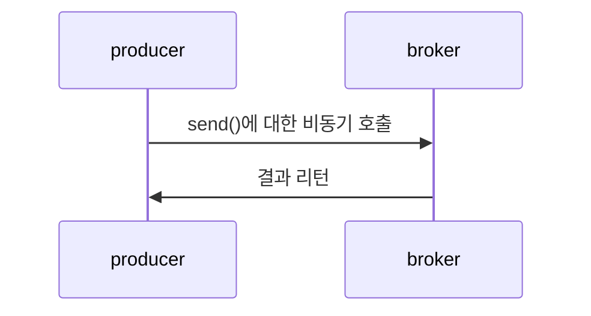
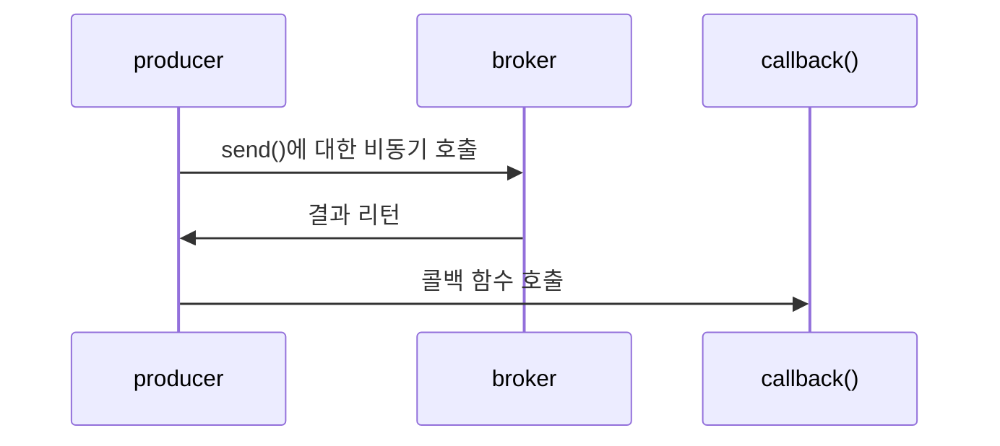

https://kafka.apache.org/documentation/#design_quotasgroups

## 3.4.1 client.id
프로듀서와 그것을 사용하는 애플리케이션을 구분하기 위한 논리적 식별자.

트러블 슈팅이 쉽게 해준다.
> "IP: 104.27.155.134에서 인증 실패가 나온다."
> 주문 확인 서비스에서 문제가 발생하고 있다.


```java

        Properties configs = new Properties();
        configs.put("bootstrap.servers", "61.33.35.156:17633"); // Kafka host 및 server 설정
        configs.put("acks", "all");                         // 자신이 보낸 메시지에 대해 카프카로부터 확인을 기다리지 않습니다.
        configs.put("block.on.buffer.full", "true");        // 서버로 보낼 레코드를 버퍼링 할 때 사용할 수 있는 전체 메모리의 바이트수
        configs.put("spring.kafka.producer.properties.security.protocol", "PLAINTEXT"); 
        configs.put("key.serializer", "org.apache.kafka.common.serialization.StringSerializer");   // serialize 설정
        configs.put("value.serializer", "org.apache.kafka.common.serialization.StringSerializer"); // serialize 설정
        configs.put("client.id", "producerWithClientId");
```
> 실제 서버에서 `producerWithClientId` 라는 이름으로 적재되는 것을 확인하고 싶었으나, 로그가 안보여서 PASS

## 3.4.2 acks
The number of acknowledgments the producer requires the leader to have received before considering a request complete.

> 프로듀서가 얼마나 많은 acknowledgments들을 요구하는지, 설정합니다.

### acks=0
> 난 모든 ack들을 받지 않을 겁니다.

프로듀서는 메시지가 성공적으로 전달되었다고 간주하고 브로커의 응답을 기다리지 않을 겁니다.

그렇기에, 가장 빠르게 메시지를 보낼 수 있지만, 프로듀서는 브로커의 현 상황을 알 방도가 없게 됩니다.

가장 높은 처리량이 필요할 때 사용될 수 있습니다.

### acks=1
> 프로듀서의 메시지 전송 1 : 브로커의 성공 응답 1

프로듀서는 리더 레플리카가 메시지를 받는 순간 브로커로부터 성공했다는 응답을 받는다.

> 리더에 크래시가 나서 프로듀서가 에러 응답을 받는다.
> 프로듀서는 데이터 유실을 막기 위해서 메시지를 재 전송을 하게 된다.
> 재 전송된 메시지는 기존의 크래시가 난 리더로 향하고 있기에, 메시지가 복제가 안 될 경우, 새롭게 선출된 리더로 메시지가 전달되지 않아 유실될 수 있다.
{: .prompt-warning }

### acks=all
> 2 이상의 브로커로부터 성공했다는 응답을 받아야 한다.

프로듀서는 모든 인-싱크 레플리카에 전달된 뒤에야 브로커로부터 성공했다는 응답을 받는다.

기본적으로 'acks=0'이 아닌 경우는 다 성공 응답을 기다리게 됩니다. 메시지가 복제되서 둘 이상의 브로커로부터 성공했다는 응답을 받아야 하므로 안정성은 높아지지만, 지연 시간은 더 늘어납니다.

`참고로 acks=-1` 세팅과 동일합니다.

## 3.4.3 메시지 전달 시간
ProducerRecord를 보낼 때, 걸리는 시간을 두 구간으로 나누어 처리합니다.

- send()에 대한 비동기 호출이 이뤄진 시간부터 결과를 리턴할 때까지.




- send()에 대한 호출이 성공적으로 리턴된 시간부터 콜백이 호출될 때까지 걸리는 시간.



### 상세히 구분을 해보자.


#### 1. max.block.ms: 프로듀서가 얼마나 오랫동안 블록되는 지
- `send()`를 호출했을 때, `partitionsFor`를 호출해서 메타데이터를 요청했을 때
> 프로듀서에서 메타데이터를 요청했다면, 해당 메타데이터를 기다려야, 프로듀서 단에서 다음 스텝을 밟을 수 있습니다. `정보가 없으면 아무것도 할 수 없으니`

그렇지만, 언제까지 기다릴 수도 없으니 예외 처리를 해야 합니다.

예외가 발생하는 경우의 수는
1. 전송 버퍼가 가득차있다.
2. 메타데이터를 사용 가능하지 않는 상태이다.

해당 상태에서 `max.block.ms` 만큼의 시간이 흐르면 예외가 발생합니다.
```java

configs.put("MAX_BLOCK_MS_CONFIG", "100");

```

#### 2. delivery.timeout.ms


`레코드 전송 준비`가 완료된 시점에서부터 브로커의 응답을 받거나 


아니면 전송을 포기하게 되는 시점까지의 제한 시간을 정합니다.

> 전송 준비부터 무엇인가의 결과가 나올때까지의 시간 제한.
> 따라서, 상당히 범위가 넓은 타임아웃이기에 다른 제한 조건의 더 넓은 제한 조건이라고 보면 됩니다.

#### request.timeout.ms
프로듀서가 `데이터를 전송할 때` 서버로부터 응답을 받기 위해 얼마나 `기다릴 것인지`를 결정한다.

#### retries, retry.backoff.ms

1. retires: 프로듀서가 메시지 전송을 포기하고 에러를 발생시킬 때까지 메시지를 재전송하는 횟수를 의미

2. retry.backoff.ms: 프로듀서는 각각의 재시도 사이에 100ms 동안 대기하는데, 이 설정값으로 대기 시간을 조절할 수 있습니다.

> 기본적으로 이 값을 건들이는 것을 추천하지는 않습니다.
> `delivery.timeout.ms` 매개변수를 잡아 주는 것을 권장합니다.

## 3.4.4 linger.ms
현재 배치를 전송하기 전까지 대기하는 시간을 결정합니다.
현재 배치가 가득 차거나 `linger.ms`에 설정된 제한 시간이 되었을 때 메시지 배치를 전송합니다.

> 디폴트는 여유 스레드가 있을 때 바로 전송을 합니다.
> 이 옵션을 사용하면, ms 만큼 더 기다리므로 지연을 조금 증가시키지만, 처리율을 크게 증가합니다.

## 3.4.5 buffer.memory
프로듀서가 메시지를 전송하기 전에 메시지를 대기시키는 버퍼의 크기를 결정합니다.

> 애플리케이션이 서버에 전달 가능한 속도보다 더 빠르게 메시지를 전송한다면, 프로듀서 쪽에 조금씩 메모리가 쌓이니, 메모리가 가득찰 수 있습니다.

## 3.4.6 Compression.type - 압축 타입
메시지는 압축되지 않는 상태로 전송이 되지만,
이 매개변수를 snappy, gzip, lz4, zstd 중 하나로 설정을 하면 메시지를 압축한 뒤 브로커로 전송합니다.

- snappy: CPU 부하 적으면서, 압축 성능 좋음
        - 압축 성능과 네트워크 대역폭 모두가 중요할 때

- gzip: CPU와 시간을 더 많이 먹음. 압축률은 좋음
        - 네트워크 대역폭이 제한적일 때


## 3.4.7 batch.size
각각의 매개변수는 각각의 배치에 사용될 메모리의 양을 결정합니다.

배치가 차면 해당 배치에 들어 있는 모든 메시지가 한꺼번에 전송되지만, 찰 때까지 기다린다는 의미는 아닙니다.

그렇기에, 매우 큰 값을 설정한다고 해서 메시지 지연이 발생하지는 않지만, 지나치게 작게 설정할 경우에는 자주 전송해야 하기에 약간의 오버헤드가 발생합니다.


## 3.4.8 max.in.flight.requests.per.connection
This setting basically controls how many requests can be made in parallel to any partition, and so, by default that setting is 5, which explains why you can have some reordering, but you have to set it to 1 if you want to strictly ensure ordering. 

> requests들을 파티션에 병렬처리할 갯수.
> 그렇기 때문에, reordering이 발생 할 수 있다.

### 주의:
retries 매개변수를 0보다 큰 값으로 설정한 상태에서 max.in.flight.requests.per.connection을 1이상으로 할 경우 순서가 바뀔 수 있습니다.

> 그래서 가장 합당한 선택은 `enable.importence=true` 설정.

## 3.4.9 max.request.size
프로듀서가 전송하는 쓰기 요청의 크기를 결정합니다.
> 쓰기 요청: batch하고 나서 보내는 사이즈.

해당 설정으로 메시지의 최대 크기와 메시지의 최대 개수 역시 제한합니다.

> 매개 변수의 기본값을 1MB로 설정을 한다면, 1KB 크기의 메시지를 1024개를 보낼 수 있다는 뜻.
> 브로커에서 할 수 있는 설정에서는 `message.max.bytes` 설정이 있는데, 프로듀서와 브로커의 설정을 맞춰야 한다.

## 3.4.10 receive.buffer.bytes, send.buffer.bytes
TCP 송수신 버퍼의 크기 설정.
값이 -1 일 경우에는 운영체제의 기본값을 사용합니다.

프로듀서나 컨슈머가 다른 데에 위치한 브로커와 통신할 경우에는 네트워크 대역폭은 낮고 지연은 길어지므로 해당 값을 올려잡아 주는 것이 좋습니다.

## 3.4.11 enable.idempotence
- '정확히 한 번' 의미 구조를 지원합니다.

1. acks=all, delivery.timeout.ms의 값을 꽤 큰 값으로 잡은 상황

2. 첫 번째 브로커가 프로듀서로 응답을 보내기 전에 크래시가 났다고 한다면, 재 전송을 시도하게 된다.

3. acks=all 설정과 재 전송으로 인해서 이미 메시지를 받은 바 있는 새 리더 브로커로 전달이 되게 되므로 메시지가 중복이 됩니다.

> 그래서 탄생한 설정 = `enable.idempotence=true`
> 프로듀서는 레코드를 보낼 때마다 순차적인 번호를 붙여서 보내게 되고, 브로커가 동일한 번호를 가진 레코드를 2개 이상 받을 경우 하나만 저장하게 됩니다.
> 프로듀서는 별다른 문제를 발생시키지 않는 DuplicateSequenceException을 받게 됩니다.

