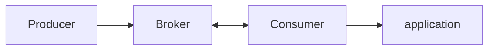
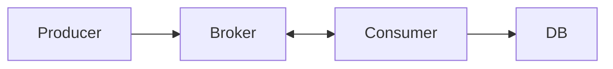
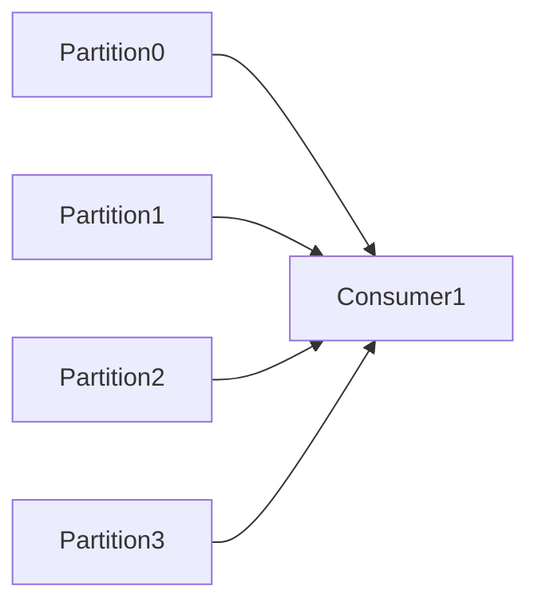
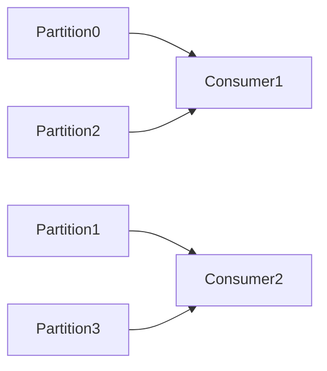
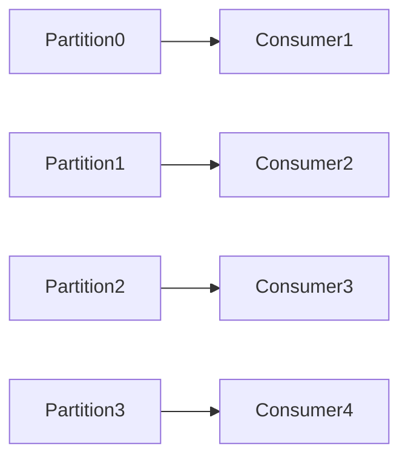
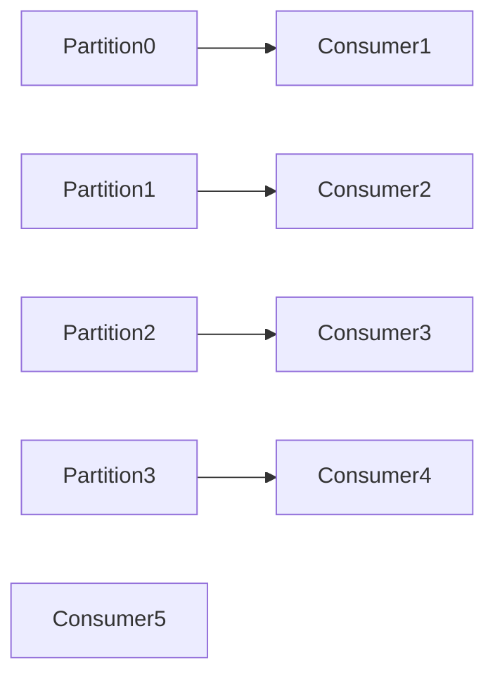

애플리케이션은 토픽을 구독하고 구독한 토픽들로부터 메시지를 받기 위해 사용합니다.

# 4.1 카프카 컨슈머: 개념
데이터를 읽어오는 방법을 이해하기 위해서는 먼저 '컨슈머'와 '컨슈머 그룹'을 이해해야 한다.

## 4.1.1 컨슈머와 컨슈머 그룹

### 컨슈머 그룹의 개념은 왜 나오게 되었을까?

상황을 가정해보자.

- Producer가 메시지를 생성하는 속도와
- message를 구독하는 Consumer가 읽고 application에 쓰는 속도가 같다면
- 단 하나의 컨슈머만 있더라도 동작을 하는 것에는 문제가 없을 겁니다.

#### 문제가 발생할 때는 Producer와 Consumer 간의 속도 차이

- 컨슈머가 구독한 메시지를 DB에 적는 것을 가정해 봅시다.
- 당연하게도, Producer가 Broker에 쓰는 메시지의 속도를 Consumer가 따라가지 못할 겁니다.
- 그 상태에서 컨슈머가 하나 뿐이라면 애플리케이션은 새로 추가되는 메시지의 속도를 따라잡을 수 없기에 메시지 처리가 뒤로 밀리게 될 것입니다.

> 그렇기에 토픽으로부터 데이터를 읽어 오는 작업을 확장할 수 있어야 합니다. 
> 그래서 카프카 컨슈머는 보통 컨슈머 그룹의 일부로서 작동하게 됩니다.
{: .prompt-info }

### 토픽과 컨슈머 그룹간의 도식도

#### 4 : 1

- 컨슈머 C1은 네 파티션 모두에게 모든 메시지를 받게 됩니다.

#### 4 : 2

- 이제 각각의 컨슈머는 2개 씩 파티션의 내용을 읽게 됩니다.

#### 4 : 4

#### 4 : 5

- Partition의 수보다 Consumer의 수가 더 많아지면, 유휴 상태가 되어 메시지를 전혀 받지 못합니다.

### 컨슈머의 확장

카프카 컨슈머가 지연 시간이 긴 작업을 수행하는 것은 흔하다.

그렇기에 하나의 단위 컨슈머가 처리하는 파티션과 메시지의 수를 분산시키는 것이 일반적인 규모 확장 방식입니다.

> 그래서 토픽을 생성을 할때, 파티션 수를 크게 잡아주는 게 좋은 이유이기도 합니다. 
> 부하가 증가함에 따라서, 더 많은 컨슈머를 추가할 수 있게 해주기 때문입니다.

#### 여러 애플리케이션이 동일한 메시지를 구독하도록

- 애플리케이션이 각자의 컨슈머 그룹을 갖도록 해야 해서, 전체 메시지의 일부가 아니라 전부 다 받도록 합니다.

- 카프카는 성능 저하 없이 많은 수의 컨슈머와 컨슈머 그룹으로 확장이 가능합니다.

## 4.1.2 컨슈머 그룹과 파티션 리밸런스

컨슈머 그룹에 속한 파티션들은 파티션에 대한 소유권을 공유합니다.

### 리밸런스가 일어나는 경우.

1. 새로운 컨슈머를 컨슈머 그룹에 추가했을 때
2. 컨슈머가 종료되거나 크래시가 났을 경우
3. 운영자가 새 파티션을 추가하는 것과 같이 컨슈머 그룹이 읽고 있는 토픽이 변경되었을 경우.

> 컨슈머에 할당된 파티션을 다른 컨슈머에게 할당해주는 작업을 `리밸런스`라고 합니다.

### 조급한 리밸런스
- 모든 컨슈머가 읽기 작업을 멈추고 자신에게 할당된 모든 파티션에 대한 소유권을 포기한 뒤, 컨슈머 그룹에 다시 참여하여 완전히 새로운 파티션 할당을 전달받는다.

### 협력적 리밸런스
- 한 컨슈머에게 할당되어 있던 파티션만을 다른 컨슈머에 재할당합니다.

#### 과정
1. 컨슈머 그룹 리더가 다른 컨슈머들에게 각자에게 할당된 파티션 중 일부가 재할당될 것이라고 통보하면, 컨슈머들은 해당 파티션에서 데이터를 읽어오는 작업을 멈추고 해당 파티션에 대한 소유권을 포기한다.
> '우리 지금 리밸런싱 할거야!' -> '너가 구독하고 있는 파티션이 리밸런싱 대상이야.' -> 컨슈머는 리밸런싱 대상의 파티션의 소유권을 포기한다.

2. 컨슈머 그룹 리더가 포기된 파티션들을 새로 할당합니다.

전체 작업이 중단되는 사태가 발생되지는 않습니다.

### 컨슈머가 소유권을 유지하는 방법
- 컨슈머는 해당 컨슈머 그룹의 그룹 코디네이터 역할을 지정받은 카프카 브로커에 `하트비트`를 전송함으로서 멤버십과 할당된 파티션에 대한 소유권을 유지합니다.

- 만약, 컨슈머가 일정 시간 이상 하트비트를 전송하지 않는다면, 세션 타임아웃이 발생하면서 그룹 코디네이터는해당 컨슈머가 죽었다고 간주하고 리밸런스를 실행합니다.

