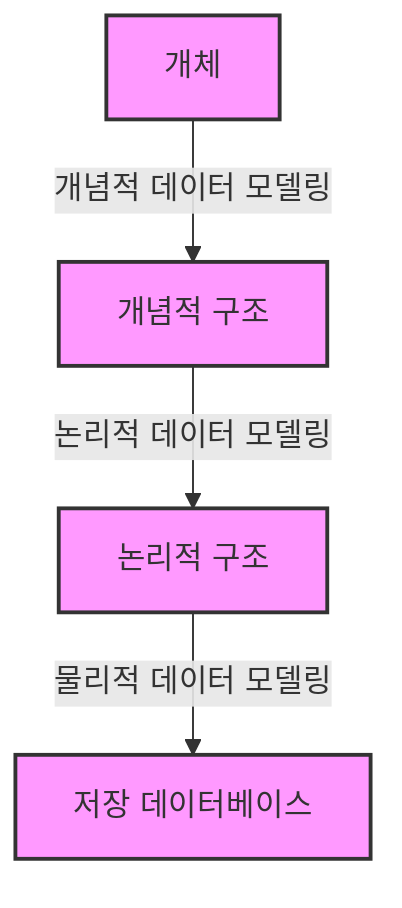

# 데이터 모델링의 3단계 진행
> 데이터 모델은 데이터베이스를 만들어내는 설계서로서 분명한 목표를 가지고 있다.<br>
> 추상화 수준에 따라서 데이터 모델, 논리적 데이터 모델, 물리적 데이터 모델로 정리할 수 있습니다.



## 가. 개념적 데이터 모델링

> 추상화 수준이 높고 업무 중심적이고 포괄적인 수준의 모델링 진행, 전사적 데이터 모델링, EA 수립 시 많이 이용

> 사용자의 데이터 요구사항을 찾고 분석하는 데서 시작한다. 이 과정은 **어떤 자료가 중요하고 또 어떤 자료가 유지되어야 하는지를 결정**하는 것도 포함된다. 이 단계에서 중요한 활동은 **핵심 엔티티와 그들 간의 관계**를 발견하고, 그것을 표현하기 위해서 엔티티-관계 다이어그램을 생성하는 것이다.

어떻게 설명하면 좋을까? 데이터 베이스의 기본적인 목표는 현실 세계를 최대한 잘 표현하는 거야.

무엇인가 컴퓨터스럽게(?) 표현하기 전에 추상적으로 표현한다고 이해하면 좋을 것 같아.

좀 더 들어가기에 앞서서, 개념적 데이터 모델링의 대표적인 툴인 ERD(개체-관계 다이어그램)의 예시를 보자.

```yaml
  ┌─────────────┐  
       영화
  │  영화 ID    │
  │  제목       │
  │  장르       │
  │  출시일     │
  └─────────────┘
      |
      |
      |
    출연 (다대다)
      |
      |
      v
  ┌─────────────┐
  │    배우     │
  │  배우 ID    │
  │  이름       │
  │  생년월일   │
  └─────────────┘

```

영화라는 데이터베이스를 구축을 할려고 하면, 필요한 것들을 개념적으로 우선 생각을 하는 거야.

그중에 하나가 영화 엔티티이고 그 다음은 배우 엔티티이야.

그래서 이 관계를 저런 도식도로 표현하는 것을 ERD라고 해.

## 나. 논리적 데이터 모델링

> 논리 데이터 모델링은 데이터베이스 설계 프로세스의 Input으로서 비즈니스 정보의 **논리적인 구조와 규칙을 명확하게 표현**하는 기법 또는 과정이라 할 수 있다.

> 데이터 모델링이 **최종적으로 완료된 상태**이고 물리적인 스키마 설계를 하기 전 단계의 **'데이터 모델'** 상태를 일컫는 말이다.

>이 단계에서 수행하는 또 한가지 중요한 활동은 **정규화**이다. 정규화는 논리 데이터 모델 상세화 과정의 대표적인 활동이다.

말이 너무 어렵다. 이번에도 아래 예시를 보여줄게.


좀 더 구체적이게 되었지.

식별자, 속성, 관계도 보여. 이 정도 수준의 논리적인 표현을 한 것을 논리적 데이터 모델링이라고 말할 수 있어.

## 다. 물리적 데이터 모델링

> 논리적 데이터 모델이 데이터 저장소로서 어떻게 컴퓨터 하드웨어에 표현될 것인가를 다룬다. 컴퓨터에 어떻게 저장될 것인가에 대한 정의를 물리적 스키마라고 한다.

> 이 단계에서 결정되는 것은 테이블, 칼럼 등으로 표현되는 물리적인 저장 구조와 사용될 저장 장치, 자료를 추출하기 위해 사용될 접근 방법들이 있다.


이것도 예시를 보면서 이해를 하는 것이 좋을 것 같아.


좀 더 쿼리스럽게 표현한 것이 보이지?

***
## 간단 정리?

- 개념적 모델링
    - 개념적으로 어떠한 것이 필요한 지 ERD를 통해서 정리하자

- 논리적 모델링
    - 모델링이 최종적으로 완성, 논리적인 규칙이 포함, 정규화 과정을 거침

- 물리적 데이터 모델링
    - 진짜 컴퓨터에 넣을 꺼야
    - 쿼리 비슷한 스타일.