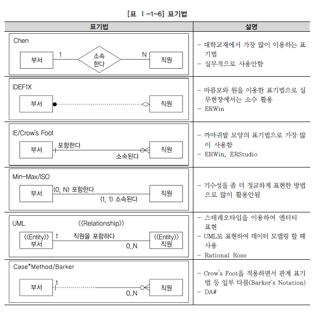

# 가. 데이터 모델 표기법

> 데이터 모델에 대한 표기법으로 1976년 피터첸이 E-R 모델이라는 표기법을 만들었다. 
> 엔티티를 사각형으로 표현하고 관계를 마름모 속성을 타원형으로 표현하는 이 표기법은 데이터 모델링에 대한 이론을 배울 때 많이 사용된다.

> 수 많은 표현법에서 IE 표기법과 바커 표기법을 적용해서 설명한다.

# 나. ERD 표기법으로 모델링하는 방법