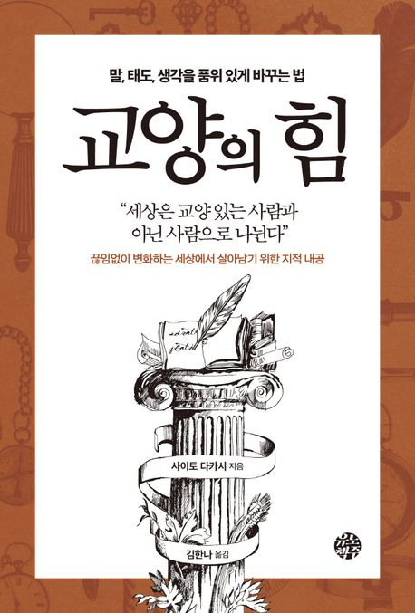
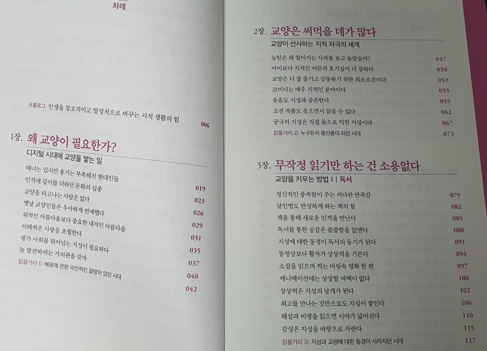
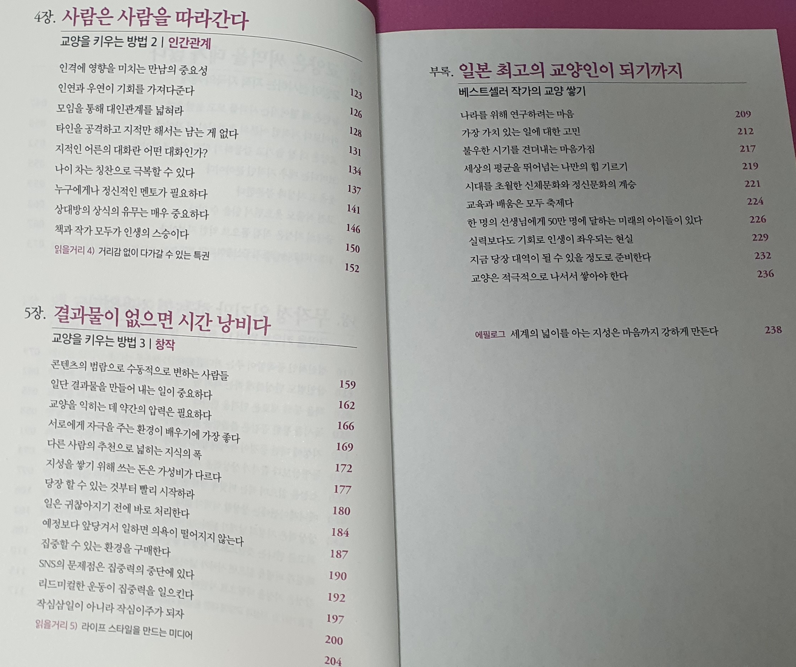

# 신경 끄기 연습

## 책을 알게 된 계기
그전에 읽은 책의 뒤 커버에 ‘교양의 힘’이라는 책을 보게 되었습니다.

신경 끄기 연습 책이 매우 마음에 들었던 저는 구성도서관에 검색을 해서 바로 대출을 했습니다.

### 이번에도 과거와 오늘을 구별할 듯 합니다.
과거 - 2023-12-23

> 오늘 - 2024-04-07

## 목차

## '교양의 힘'에서 언급된 책들
이 책에서는 언급된 고전 책들이 많습니다. 한번 이 저자가 언급한 책들을 다 읽어보는 것을 도전하고자 합니다.

1. 차라투스트라는 이렇게 말했다 - 니체
2. 학문의 권장 - 후쿠자와 유키
3. 백 년의 고독
4. 폭풍의 언덕 - 에밀레 브론테
5. 카라마조프가의 형제들, 악령 - 도스토옙스키
6. 지식창조 비즈니스 - 노나카 이쿠지로
7. 풍자화전 - 제아미
8. 영웅전
9. 논어, 논어이야
10. 인간실격
11. 세계문학전집
12. 삼총사, 소공녀, 햄릿, 베니스의 상인, 부활
13. 행복의 정복 - 버트런드 러셀
14. 나생문 - 아쿠타가와 류노스케
15. 언덕 위의 구름, 료마가 간다.
16. 학문의 권장, 후쿠옹 자전 - 후쿠자와 유키치
17. 방법서설 - 데카르트

## 머릿말

책을 읽으면서 프롤로그, 머릿말 부분에서 많은 것을 느끼게 된 듯합니다.

`도쿄 대학교에서는 대체로 지식이 풍부한 사람들이 모인 대학이라서 공부를 열심히 하는 사람들이 많지만, 보기에도 탁한 공기를 뿜어내거나, 실제로 대화를 했을 때 표정이 어두운 사람이 많았다.`

내가 저러한 삶을 살지 않았는지, 반성을 하게 되는 계기가 되었습니다.

고등학교를 졸업하고 대학교를 졸업하고 지금도 나름대로의 공부를 쌓아가고 있는 데, 나의 20대는 저런 분위기를 내었다는 것을 누구보다도 더 내가 잘 알기 때문입니다.

책에서는 새로운 자극을 줄 만한 것을 능동적으로 찾아 나서는 것이 교양인의 삶이라고 합니다.

> 이 책을 처음 읽었을 때에도 많이 찔렸지만, 지금도 엄청 찔리네요. 지금은 이 분위기를 벗어나기 위해서 할 수 있는 모든 수단을 하고 있는 듯 합니다.
집 밖에 나가지 않던 내가 매주 토요일마다 나가고 고정적으로 만나는 사람들과 모임이 있다는 것을 처음으로 이 독후감을 쓴 내가 알았다면 좋았겠다는 생각을 합니다.
분명 그에게 도움이 됐을 텐데요.

> 어제(2024-04-13)에 한강으로 피크닉을 갔습니다. 모임의 스테프 한분께서 "탁한 분위기"가 조금은 정화되었을까요?

## 전달하지 않는 사람은 교양인이 아니다.

지식을 축적만 하는 사람, 창작의 자원으로 사용하지 않는 사람은 교양인이 아니다.

언제부터 인가, 지식은 보유하는 것에만 중점을 둔 듯합니다. 분명, 중-고등학생일 때는 내가 알고 있는 점들을 알려주고 그 나름대로의 재미를 가진적이 있었습니다.
또한, 태권도를 4품까지 하면서, 내가 알고 있는 것을 알려 줄 때 보람도 많이 느꼈었습니다.

분명, 그때까지는 교양인의 삶과 가까웠지 않을까 생각합니다.
주변에 사람들이 줄었다는 핑계로, 알려줄 지식의 부재로, 혹은 지식을 전달할 장소의 문제로 교양인의 삶과 멀어진 듯 합니다.

사실, 이 노션(과거)에 기록을 한 것은 포트폴리오로서의 역할을 기대했기 때문입니다.
그래서, 웹에 배포를 했고 글을 쓰게 되었습니다.
의도치 않게 교양인의 삶에 조금씩 조금씩 가까워지지 않았나 싶습니다.
개인적으로는 오늘의 기록과 1년 후의 기록, 그 1년 후의 기록이 모두 어떻게 될지도 궁금하기도 합니다.

공부를 다른 관점으로 보지 않을까 싶습니다.
폐쇄적이지 않는 누군가와 공유하기 위한 공부와 경험은 나중에 할 말들이 많을 듯합니다.

솔직히, 컴퓨터 공부 지겹습니다. 솔직히, 일어 한자 공부 어렵습니다. 하루 지나면 까먹습니다.
영어, 흠…. 그리고 취업을 향한 이 과정 괴롭기도 합니다.
성격을 조금씩 바꿔보고자 관련 책들을 읽고 있는 모습에는 가끔은 안쓰럽기도 합니다.

그렇지만, 이 모든 경험과 지식들을 누군가에게 공유할 수 있다면 나의 이 고민, 지식, 경험들이 빛을 보지 않을까 싶습니다.
내가 다양한 책들을 통해서 나를 찾아가고 지식을 쌓는데 도움을 받았는데, 나도 해야겠다는 의무감도 들기도 합니다.

예전에 이런 말을 한 아이돌이 있던 듯합니다. 본인 직업의 가장 큰 장점은 나의 과거와 노력들이 기록이 되는 점들이라고 했습니다.

저도 그분의 말처럼, 글로서 기록을 남겨보고자 합니다.

## 교양을 타고나는 사람은 없다.

‘유전자’에 대한 이야기를 책에서는 하고 있습니다.
외모, 쌍꺼풀, 금수저와 같은 선천적인 것에 사로잡혀 있는 사회에 대해서 경고를 합니다.

인류 문명은 진보했지만, 오히려 더더욱 유전자에 대해서만 말하게 되면, 후천적으로 쌓아 올린 교양을 경시하게 된다고 말하고 있습니다.

저부터 반성하고 있습니다. 사람 속을 알기 어렵다는 이유로 겉 모습을 더 보지 않았나 싶습니다.

순간적으로 들어오는 인상에 확대 해석하지 않았나 싶습니다. 저도 첫 인상으로 오해를 많이 받는 입장에서 하지 말아야 할 행동을 남에게는 하지 않았나 싶습니다.

## 이해력은 사랑을 초월한다.
소통력과 이해력, 공감력 등 나를 이해해 준다 라고 느낄 만한 기준을 세워서 대인관계의 선택의 폭을 넓혀라.

사실 아직도 이해력이 무엇인지 잘 모르겠습니다.

추상적으로 느껴지고 어느 행동, 어느 마음을 가지고 어느 생각을 가져야 이해력이 있는 사람인지 기준점이 저에게는 매우 애매모호합니다.

만약, 그 이해력이 상대방을 우선시하는 생각과 마음이라면 스스로에게 자신이 없어서 다른 사람에게 다가가는 태도가 소극적입니다.
그렇다 보니, 마치 버릇처럼 타인의 입장을 생각하고 행동하는 저는 이해력이 깊은 사람이라고 말할 수 있을까요?

## 평가 사회를 뛰어넘는 지성이 필요하다.

현대 사회인지 용기가 부족하다는 이유로 평가 사회가 된 것을 저자는 꼽습니다.

지금의 사회가 마치 중고차 판매처럼, 어디에 어떠한 흠집이, 그리고 어떠한 결함이 있는 지를 중점적으로 본다고 말하고 있습니다.

그래서, 남의 눈을 신경 쓰는 겁쟁이가 되지 않았는지 돌아보기도 합니다.

사실 저도 저의 단점이라고 생각하는 점들을 숨기고자 노력했던 듯 합니다.
졸업 후의 나의 행보가 있어 보이듯이 꾸며보고, 단점으로 지적될 만한 점들을 숨기고자 했습니다.

녹십자 면접을 보기 전에, 인 적성 검사를 진행한 적이 있습니다. 솔직하게 적었습니다. 숨기고 싶지 않았고 ‘마음에 들지 않으면 떨어트려라’ 라는 생각이였습니다.
면접관님이 질문했습니다. “잘 어울릴 수 있냐고?”

사실, 한때는 제 성격을 싫어했습니다. 어울리는 것을 잘 못하고 어느 조직, 집단에 들어가는 것이 힘들어하고 있습니다.
> 사실, 지금도 그렇게 좋아하지는 않긴 합니다. 하지만, 여러번 만나는 사람에게는 개성으로서 받아들여지고 있는 듯 합니다.

# 제2장. 교양은 써먹을 때가 많다.

## 교양은 더 잘 즐기기고 감동하기 위한 최소 조건이다.

뉴턴이 사과가 떨어지는 것을 보고 만유인력을 생각한 이유는 그전에 물리학의 기초를 알았기 때문입니다.

아는 만큼 보인다 라는 것에 대표 예시가 되지 않을 까 생각합니다.

기존에는 무엇 인가를 즐길 때, 충분히 공부를 하고 즐겼는가? 싶습니다.
저의 취미는 영화, 에니메이션, 만화, 운동, 독서, 게임입니다.
> 이제는 영화, 애니메이션, 운동, 독서, 영어 일까요? 게임은 취업후 안하게 되네요.
그중에서, 영화를 가볍게 공부하고 보면, 어떠한 풍경이 보일지 궁금하기도 합니다.

또, 다른 무엇인가를 도전을 할 때, 사전에 공부를 하고 도전을 하면 좋겠다는 생각도 들기도 합니다.

>영어로 연기하는 모임을 가면서, 영화를 보고갈 때와 그렇지 않을 때의 몰입감과 결과물에 큰 차이를 느끼고 있습니다. 일부 씬을 보는 것과 전체를 보는 것의 차이이지 않을까요?

# 제3장. 무작정 읽기만 하는 건 소용없다.

## 지성에 대한 동경이 독서의 동경이 된다.

## 최고를 만나는 것 만으로도 지성이 쌓인다.

## 해설과 비평을 읽으면 시야가 넓어진다.

이 장에서는 대부분 상상력의 중요성을 알려줍니다. 활자가 동영상보다 나은 점은 필연적으로 장면을 상상 해야 하기 때문입니다.

그래서 독서는 지겹고, 괴롭고, 피곤한가 봅니다. 유튜브, 넷플릭스를 통해서 영상을 그대로 받아들이면, 상상을 할 필요도 그럴 노력도 필요 없습니다.

개발자를 목표로 하는 저로서는 상상력은 필요합니다. 코드가 어떻게 동작을 하는지, 전체적인 시스템이 어떻게 돌아가는 지 필연적으로 상상을 해야 합니다.

지식과 지식을 연결하는데 상상력이 필요할 지 모릅니다. 통계 기술을 가지고 가설을 작성할 때도 필연적으로 분석 결과에 대한 상상력이 필요합니다.

최근에 운동을 하면서도 알게 모르게 상상력을 활용하고 있는 듯합니다. 어떠한 동작을 수행을 할 때,  어느 방향으로 힘을 쓸지, 어느 부위를 쓸지, 강도는, 자세는 이러한 생각들이 상상력인 듯합니다.

이 기능이 떨어진다고 생각하니, 너무 아깝다는 생각밖에 안 듭니다. 소중히 다뤄야 하는 기능이니, 조심스럽게 잃지 않도록 하겠습니다.

# 4장. 사람은 사람을 따라간다.

## 인격에 영향을 미치는 만남의 중요성.

## 인연과 우연이 기회를 가져다준다.

## 모임을 통해 대인 관계를 넓혀라.

## 타인을 공격하고 지적만 해서는 남는 게 없다.

사실, 나의 20대에서 가장 부족하고 괄시했던 것이 무엇이냐면 '만남'입니다.
만남의 중요성을 생각하지 않았고 귀찮고 귀찮다는 이유로 아니, 어떠한 이유를 만들어 내서도 가지 않았습니다. 술을 못 마신다는 이유로 술자리도 다 피했습니다.

얼마나 많은 인연과 우연을 놓쳤는가, 그 덕분에 얼마나 많은 황량한 마음을 가지게 되었는 지는 다른 사람도 아닌, 내가 더 잘 알고 있습니다.
그래도 27살에(작성하고 있는 날짜는 2023년 12월 26일) 부족했던 점을 알고 후회하고 반성하고 있다는 점은 앞으로 있을 만남에 기대가 됩니다.(친해지는 것은 여전히 힘들겠지만..?)

위의 3장의 상상력과 함께 적고 싶은 말이 있습니다.

제가 애인이 없는 이유는 절대적인 만남의 수가 적었을 지도 모르지만, 사실은 누군가 내 옆에 있을 거란 상상이 하나도 되지 않습니다.
> -_-;;

이 이야기를 한 명의 친구에게 말을 한 적이 있습니다. 답장은 ‘그게 말이 되냐고?’, ‘어떻게 누가 옆에 있는 것이, 손을 잡는 것이, 더 한 행동들을 하는 것이 상상이 되지 않냐고?’

책임감의 문제인지, 정신, 심리적인 문제인지는 모르겠습니다.

대통령이 되고 싶어요. 과학자가 되고 싶어요. 유튜버가 되고 싶어요. 는 말하는 것과 동시에 목표한 바를 동시에 상상을 하는 행위라고 생각합니다.

목표는 상상이고 상상이 있기에 목표가 있는 건데, 상상 없는 연애와 만남은 무슨 의미가 있을 까 싶습니다.

황량해진 마음에 물 한 방울부터 시작해서 씨앗 하나, 둘, 셋 그리고 촉촉해진 땅에 나무 한 그루 열매가 2, 3개 열렸으면 좋겠습니다.

# 5장. 결과물이 없으면 시간 낭비다.

## 일단 결과물을 만들어 내는 것이 중요하다.

창조적이고 지적으로 살아가는 데의 최소 조건은 결과물을 만들어 내는 것이다.

퀄리티는 고사하고 결과물을 내기 쉬워진 세상이 된 것은 아무도 부정할 수 없는 사실입니다. 이렇게 노션을 통해서 글을 쓰는 행위도 당연히 결과물을 내는 행위 중에 하나이죠.

책의 머릿말과 용기가 부족해진 현대인과 결과물을 한꺼번에 묶어서 말하고 싶습니다.

결과물을 내서 출판한다는 것은 타인에게 공개할 용기를 가진 사람, 비판을 받을 용기가 있는 사람입니다. 그런 측면에서는 결과물을 보여주는 사람들은 단순히 보기만 하는 사람보다는 용기 있고 교양인에 가깝지 않을까요?

## 다른 사람의 추천으로 넓히는 지식의 폭

하드리아누스 황제의 회상록 - 마르그리트 유르스나르

고대 이집트 지식 도감, 말 많은 그리스 지식 여행, 고대 마야, 아스텍 불가사의 대전

## 당장 할 수 있는 것부터 빨리 시작해라.

## 작심삼일이 아닌 작심2주가 되자.

꼭 지속적으로 할 필요가 없다. 그저, 가벼운 마음으로 시작을 하고 2주가 지나서도 계속 하고 싶으면 ‘계속력’을 발휘하면 됩니다.

# 6. 부록

## 불우한 시기를 이겨내는 마음가짐.

‘모아두는 시기’

'내 세상을 널리 알리는 시기가 반드시 올 것이라는 이미지를 갖고 있었다. 당시의 나는 지금의 내가 ‘모아두는 시기’, 즉 언젠가 폭발적으로 세상에 알리는 시대를 준비하는 시기라고 판단했다.' 라고 뒤늦게 성공한 다른 작가가 한 말입니다.
> 저도 돌이켜 보면, 취업까지의 2년이 모아두는 시간이였습니다. 분명 괴로웠지만, 그랬기 때문에, 지금 내 역할이 사회에 존재한다는 것에 대한 고마움을 매일 느끼고 있습니다. 출근이 매우 좋더라고요. 그걸 토대로 새로운 만남을 이어갈 수도 있고요.
성숙해지고 날 돌이켜 볼 수 있는 시간이였습니다.

## 지금 당장 대역이 될 수 있을 정도로 준비한다.

## 교양은 적극적으로 나서서 쌓아야 한다.

# 정리

이 책을 다 읽고 (최초에 한번, 독후감으로 한번) 수동적인 삶을 살고 모습이 보이면, 교양의 삶으로 돌아가야 한다고 생각하는 버릇이 생겼습니다.

스스로에게 가스라이팅(?)을 하고 아는 것에 대한 즐거움과 아는 것을 통한 호기심이 나오도록 노력하고 있습니다.

세상엔 아직도 경험해야 할, 배워야 할 것들이 너무 나도 많습니다. 가만히 앉아서 신세 한탄할 시간은 없는 듯합니다.
> 이거 하나는 잘 지키고 있는 듯 합니다.