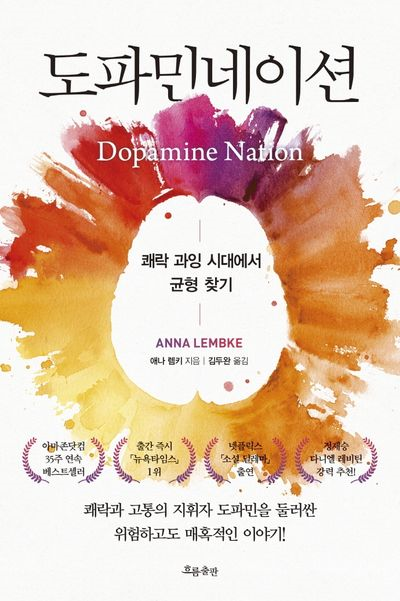

## 책을 알게 된 계기
이 책을 알게 된 계기가 어떻게 되었을까? 혼자서 생각해보았습니다.

유튜브에서 뇌과학자가 진행하는 유튜브에서 본 듯하면서, 평상시 사용하는 어플의 독서 모임의 

썸네일에서 본 듯한 듯합니다. 그렇게 봄으로서 1차적으로 알았고 밀리의 서제를 구독을 통해서 읽게 되었습니다.

책의 분량이 매우 많다 보니 목차를 보고 다시 생각을 정리해 보고자 합니다.

오늘은 근로자의 날입니다. 책을 읽은 지, 거의 한달이 다 되어갔기에 오히려 남은 기억들은 더 가치가 있다고 생각합니다.

## 누구나 이중생활을 한다.

책에서의 이중생활의 예시는 보편적으로 매우 강한 편에 속할 겁니다. '자위 기구', '마약'에 비하면

우리가 하고 있는 이중생활의 강도는 매우 낮아 보입니다.

책에서 나온 말처럼, 강도로서 접근을 하게 되면 