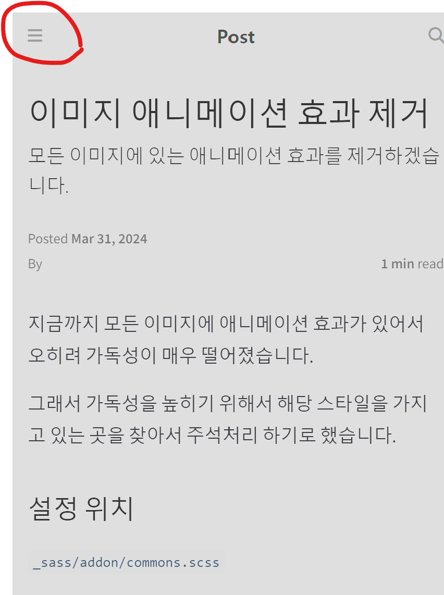
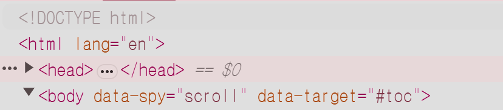
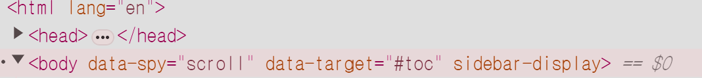
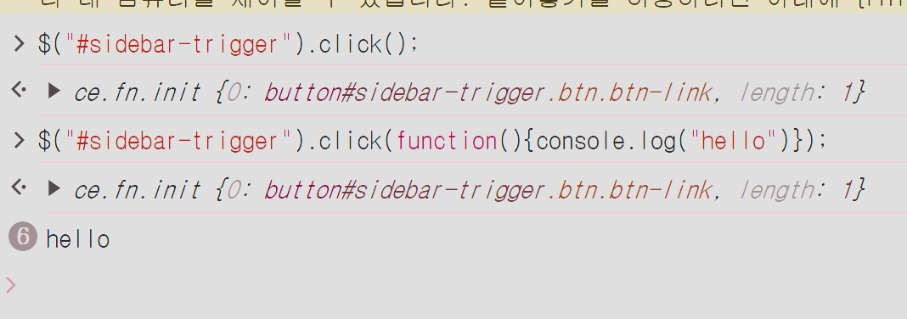

# 현재 상황


화면을 작은 상황에서 해당 메뉴 버튼을 클릭이 동작을 하지 않습니다.

따라서, 웹 화면을 축소 했을 때, 그리고 모바일 환경에서는 정상적으로 동작하지 않고 있습니다.

## 원인 찾기
동일 사이트의 다른 블로그 설정을 보기로 했습니다.


> 클릭 하기 전에는 `sidebar-display` 가 뜨지 않는 상태이지만.


> 클릭을 하면 `sidebar-display` 가 뜹니다.

## 유추 할 수 있는 원인

1. 리스너의 문제
2. 설정의 문제 - 아마 css 건들면서 건들여 졌을 수도.


## javascript 위치

`_javascript/modules/components/sidebar.js`


## 코드 동작 확인
```javascript

$("#sidebar-trigger").click(function(){console.log("hello")})
```


> 제대로 동작함.

## 우선, 헬로 콘솔을 붙여넣었다.
```javascript

  $('#sidebar-trigger').click(function () {
    console.log('hello');
    sidebarUtil.toggle();
  });
```