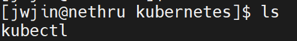

## kubectl

쿠버네티스 커맨드 라인 도구 `kubectl`. 클러스터에 대해 명령을 실행할 수 있다.

`kubectl`을 사용하여 애플리케이션을 배포하고, 클러스터 리소스를 검사 및 관리하고 로그를 볼 수 있다.

> 클러스터 단에서 내리는 명령은 `kubectl`을 통해서 진행한다.

### 리눅스에 kubectl 설치하기

[리눅스에 kubectl 설치 공식 문서](https://kubernetes.io/ko/docs/tasks/tools/install-kubectl-linux/)

1. 아래 명령으로 최신 `kubectl` 바이너리를 다운로드 합니다.

```shell

curl -LO "https://dl.k8s.io/release/$(curl -L -s https://dl.k8s.io/release/stable.txt)/bin/linux/amd64/kubectl"

```

> 위처럼, 다운이 되는 것을 확인할 수 있다.

2. root 접근 권한이 없을 경우 실행하기

- 실행 가능하도록 설정
```shell
chmod +x kubectl
mkdir -p ~/.local/bin
<!-- 아래 디렉토리ㄴ에서는 kubectl을 설치할 수 있다. -->
mv ./kubectl ~/.local/bin/kubectl 


```

- 환경 변수를 등록한다.

```shell

echo 'export PATH=$HOME/.local/bin:$PATH' >> ~/.bashrc
source ~/.bashrc

```

- 설치 확인

```shell

[jwjin@nethru ~]$ kubectl version --client
Client Version: v1.31.1
Kustomize Version: v5.4.2
[jwjin@nethru ~]$ kubectl version --client --output=yaml
clientVersion:
  buildDate: "2024-09-11T21:28:00Z"
  compiler: gc
  gitCommit: 948afe5ca072329a73c8e79ed5938717a5cb3d21
  gitTreeState: clean
  gitVersion: v1.31.1
  goVersion: go1.22.6
  major: "1"
  minor: "31"
  platform: linux/amd64
kustomizeVersion: v5.4.2


```

## kubeadm

[kubeadm 공식 문서](https://kubernetes.io/docs/setup/production-environment/tools/kubeadm/install-kubeadm/)

