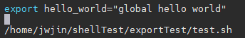
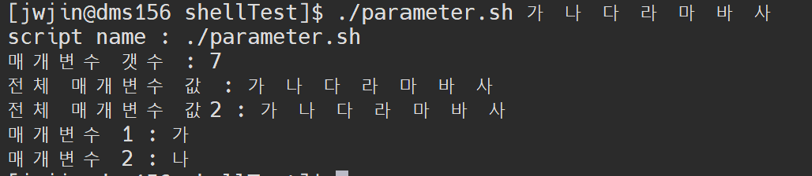

# 이 내용은 블로그 내용을 개인 정리한 글이니 친절한 설명은 아래 글을 참고하세요
https://inpa.tistory.com/entry/LINUX-%EC%89%98-%ED%94%84%EB%A1%9C%EA%B7%B8%EB%9E%98%EB%B0%8D-%ED%95%B5%EC%8B%AC-%EB%AC%B8%EB%B2%95-%EC%B4%9D%EC%A0%95%EB%A6%AC

## shebang
- 어느 쉘로 스크립트를 실행할 것인가
```shell

vim script.sh

#!/usr/bin/bash

echo $(which bash)

```


## 쉘 변수 선언

```shell

#!/usr/bin/bash

name="inpa"
pass=123123

echo $name
echo "my name is mr.${name}"
echo "my name is mr.$name"

printf "%s" $pass

```


> 1. 값을 할당 할때는 띄어쓰기를 하지 않는다.
> 2. 변수를 사용할 때는 $ 표시를 사용한다.
> 3. echo: 개행, printf: 개행을 하지 않는다.

## 전역 변수 & 지역 변수


```shell
#!/usr/bin/bash

string="hello world"

function string_test(){
    local string="hello local @@"
    echo ${string}
}

string_test
echo ${string}

unset string

```


> 지역 변수 선언: local
> 함수 사용은 함수 이름을 적으면 된다.

## 환경 변수
- 자식 스크립트에서 사용할 수 있게 한다.
- 자식 스크립트라는 표현때문에 복잡하게 생각했는데 스크립트 안에서 다른 스크립트를 호출하는 개념으로 이해하면 된다.

### 쉘 파일 상황


### test.sh


### export_test.sh


> 환경 변수로서 변수를 설정을 하고 다른 스크립트를 실행을 하면,
> 호출된 다른 스크립트는 환경 변수를 기존 변수로서 활용이 가능하다.

## 매개 변수
### 정확한 설명
https://inpa.tistory.com/entry/LINUX-%EC%89%98-%ED%94%84%EB%A1%9C%EA%B7%B8%EB%9E%98%EB%B0%8D-%ED%95%B5%EC%8B%AC-%EB%AC%B8%EB%B2%95-%EC%B4%9D%EC%A0%95%EB%A6%AC




## 예역 변수
https://inpa.tistory.com/entry/LINUX-%EC%89%98-%ED%94%84%EB%A1%9C%EA%B7%B8%EB%9E%98%EB%B0%8D-%ED%95%B5%EC%8B%AC-%EB%AC%B8%EB%B2%95-%EC%B4%9D%EC%A0%95%EB%A6%AC

## 쉘 산술 연산

1. expr 연산자: 역따옴표로 감싸준다.
2. let: 일반 프로그래밍 하듯이 사용할 수 있는
3. $(()): 괄호안에 연산하고 싶은 것을 넣는다.

## 쉘 조건문
- if, fi, []
- fi로 if문의 끝을 알려주고 if [] 사이에는 공백이 있어야 한다.

```shell

if [ 값1 조건식 값2 ]
then
    수행1
else
    수행2
fi


# 가독성 좋기 위해 then을 if [] 와 붙여쓰려면 반드시 세미콜론 ; 을 써야한다.
if [ 값1 조건식 값2 ]; then
    수행1
else
    수행2
fi

```
### 참조
1. 파일 검사
2. 논리 연산

https://inpa.tistory.com/entry/LINUX-%EC%89%98-%ED%94%84%EB%A1%9C%EA%B7%B8%EB%9E%98%EB%B0%8D-%ED%95%B5%EC%8B%AC-%EB%AC%B8%EB%B2%95-%EC%B4%9D%EC%A0%95%EB%A6%AC
