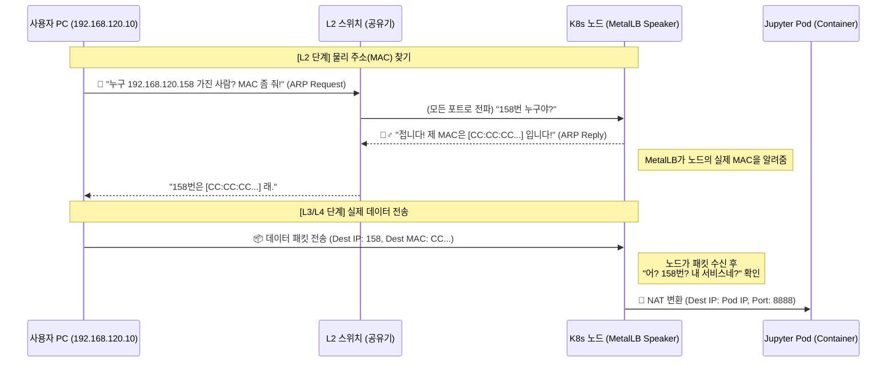

```mermaid

sequenceDiagram
    participant User as 사용자 PC (192.168.120.10)
    participant Switch as L2 스위치 (공유기)
    participant Node as K8s 노드 (MetalLB Speaker)
    participant Pod as Jupyter Pod (Container)

    Note over User, Node: [L2 단계] 물리 주소(MAC) 찾기
    User->>Switch: 📢 "누구 192.168.120.158 가진 사람? MAC 좀 줘!" (ARP Request)
    Switch->>Node: (모든 포트로 전파) "158번 누구야?"
    Node-->>Switch: 🙋‍♂️ "접니다! 제 MAC은 [CC:CC:CC...] 입니다!" (ARP Reply)
    Note right of Node: MetalLB가 노드의 실제 MAC을 알려줌
    Switch-->>User: "158번은 [CC:CC:CC...] 래."

    Note over User, Node: [L3/L4 단계] 실제 데이터 전송
    User->>Node: 📦 데이터 패킷 전송 (Dest IP: 158, Dest MAC: CC...)
    Note right of Node: 노드가 패킷 수신 후<br/>"어? 158번? 내 서비스네?" 확인
    Node->>Pod: 🔀 NAT 변환 (Dest IP: Pod IP, Port: 8888)
```
