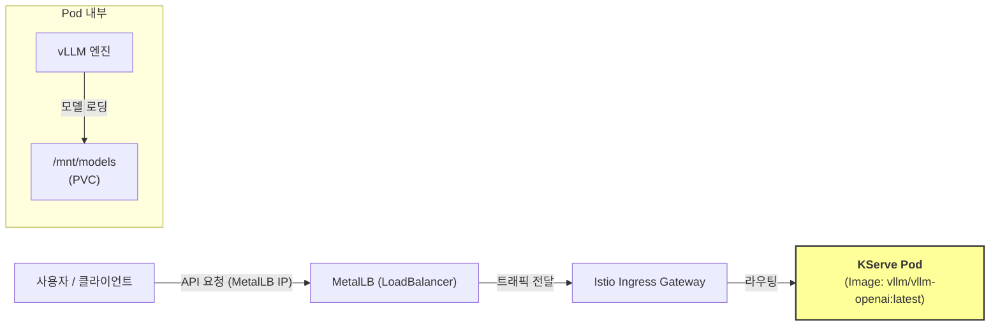

```mermaid

graph LR
    User["사용자 / 클라이언트"] -- "API 요청 (MetalLB IP)" --> LB["MetalLB (LoadBalancer)"]
    LB -- "트래픽 전달" --> Ingress["Istio Ingress Gateway"]
    Ingress -- "라우팅" --> Pod["<b>KServe Pod</b><br/>(Image: vllm/vllm-openai:latest)"]

    subgraph "Pod 내부"
        Container["vLLM 엔진"] -- "모델 로딩" --> Mount["/mnt/models<br/>(PVC)"]
    end

    style Pod fill:#ff9,stroke:#333,stroke-width:2px
```
