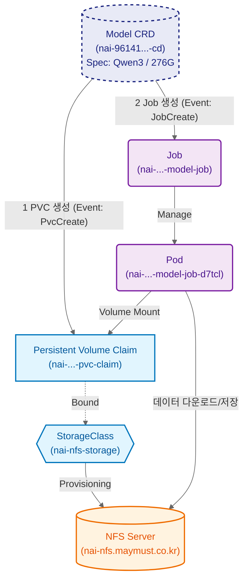

- Nai가 고유ID: UUID를 생성을 한다.

```mermaid
flowchart TD
    %% --- 스타일 정의 ---
    classDef crd fill:#E8EAF6,stroke:#1A237E,stroke-width:2px,color:#1A237E,stroke-dasharray: 5 5
    classDef config fill:#E1F5FE,stroke:#0277BD,stroke-width:2px,color:#01579B
    classDef workload fill:#F3E5F5,stroke:#7B1FA2,stroke-width:2px,color:#4A148C
    classDef storage fill:#FFF3E0,stroke:#EF6C00,stroke-width:2px,color:#E65100
    
    %% --- 1. 최상위 리소스 (Model) ---
    %% 따옴표로 감싸서 특수문자 오류 방지
    Model[("Model CRD<br>(nai-96141...-cd)<br>Spec: Qwen3 / 276G")]:::crd

    %% --- 2. 설정 및 스토리지 리소스 ---
    SC{{"StorageClass<br>(nai-nfs-storage)"}}:::config
    PVC["Persistent Volume Claim<br>(nai-...-pvc-claim)"]:::config
    
    %% --- 3. 워크로드 리소스 ---
    Job("Job<br>(nai-...-model-job)"):::workload
    Pod("Pod<br>(nai-...-model-job-d7tcl)"):::workload
    
    %% --- 4. 물리 인프라 ---
    NFS[("NFS Server<br>(nai-nfs.maymust.co.kr)")]:::storage

    %% --- 연결 흐름 (Orchestration) ---
    Model == "1 PVC 생성 (Event: PvcCreate)" ==> PVC
    Model == "2 Job 생성 (Event: JobCreate)" ==> Job

    %% --- 기존 연결 흐름 ---
    PVC -.->|"Bound"| SC
    SC ==>|"Provisioning"| NFS
    
    Job -->|"Manage"| Pod
    Pod -->|"Volume Mount"| PVC
    Pod == "데이터 다운로드/저장" ==> NFS

    %% --- 그래프 스타일 ---
    linkStyle default stroke:#666,stroke-width:1px,fill:none

```

