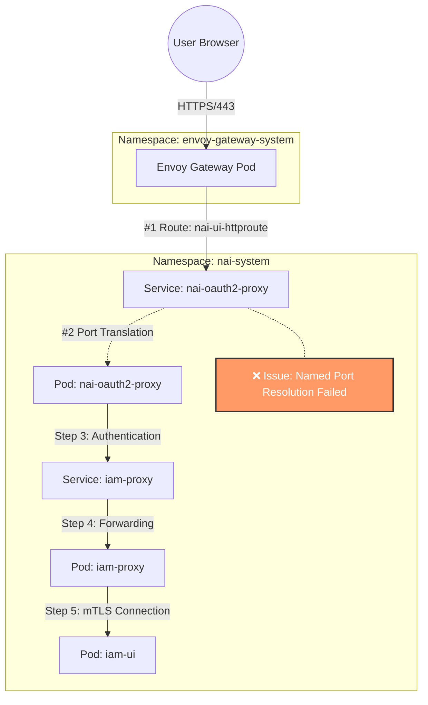

```mermaid

flowchart TD
    User((User Browser)) -->|"HTTPS/443"| GW[Envoy Gateway Pod]

    subgraph "Namespace: envoy-gateway-system"
        GW
    end

    subgraph "Namespace: nai-system"
        direction TB
        
        %% '1. ' 패턴을 '#1 '로 변경하여 리스트 인식을 방지함
        GW -->|"#1 Route: nai-ui-httproute"| SVC_OAuth[Service: nai-oauth2-proxy]
        
        SVC_OAuth -.->|"#2 Port Translation"| Pod_OAuth[Pod: nai-oauth2-proxy]
        
        note_issue[❌ Issue: Named Port Resolution Failed]:::errorStyle
        SVC_OAuth -.- note_issue
        
        Pod_OAuth -->|"Step 3: Authentication"| SVC_IAM[Service: iam-proxy]
        SVC_IAM -->|"Step 4: Forwarding"| Pod_IAM[Pod: iam-proxy]
        Pod_IAM -->|"Step 5: mTLS Connection"| Pod_UI[Pod: iam-ui]
    end

    classDef errorStyle fill:#f96,stroke:#333,stroke-width:2px,color:white;


```

